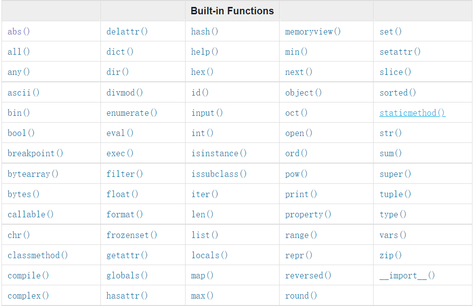
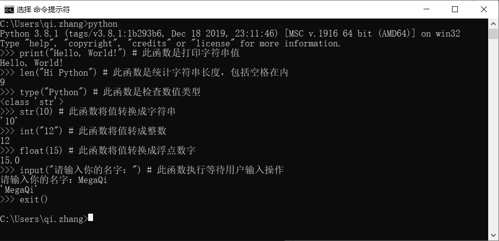
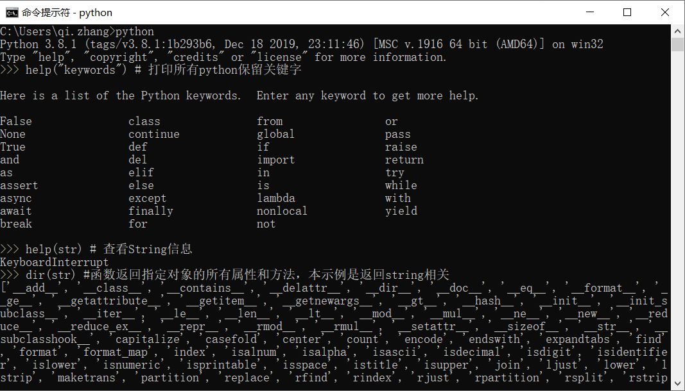
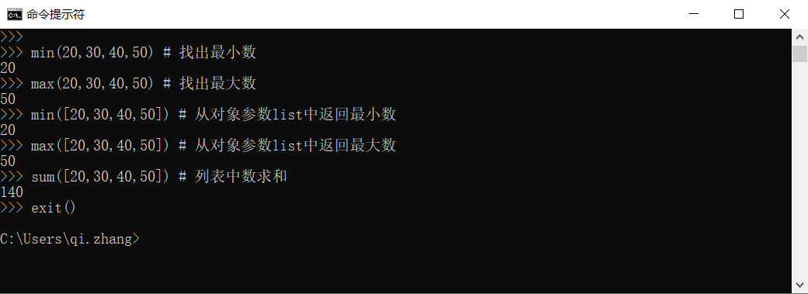

[<< Day 1](../readme.md) | [Day 3 >>](../03_Day_Operators/03_operators.md)

- [📘 Day 2](#-day-2)
  - [内置函数](#内置函数)
  - [变量](#变量)
    - [命名规则](#命名规则)
    - [变量声明](#变量声明)
  - [数据类型](#数据类型)
    - [识别和转换](#识别和转换)
    - [数字类型](#数字类型)
  - [💻 第2天练习](#-第2天练习)
    - [练习1级](#练习1级)
    - [练习2级](#练习2级)

# 📘 Day 2

## 内置函数

在Python中有很多的内置函数方法，它们全局的函数，这就意味着无需导入或配置你就可以直接使用。一些常见的Python内置函数如：_print(), len(), type(), int(), float(), str(), input(), list(), dict(), min(), max(), sum(), sorted(), open(), file(), help(), and dir()。_在下边表格中将罗列出来在Python官方文档的内置函数。
> 📖内置函数 [https://docs.python.org/3.9/library/functions.html](https://docs.python.org/3.9/library/functions.html)



让我们打开Python shell 来测试几个内置函数。



接下来再通过使用不同的内置函数来进行更多练习



从上面的终端中可以看到，Python有些保留关键字，我们不能使用这些关键词去定义变量和函数，变量我们将在下后进行介绍。

我相信，到目前为止你已经熟悉了一些内置函数，让我们再多一点练习，然后开始下一部分内容。



## 变量

变量是存储在计算机内存中的数据，在很多编程语言中都使用标记变量。这种变量是一种容易关联和记住的变量名，变量指的是存储数据的内存地址。命名变量时不允许以数字、特殊字符、连字符开头。变量名可以是一个短字符（如：x，y，z），但强烈建议用更具描述性的名称（如：名称、年龄、国家）。

### 命名规则
**Python变量的命名规则**：

- 变量名必须以字母或下划线字符开头
- 变量名不能以数字开头
- 变量名只能包含字母、数字字符和下划线（Az、0-9 和 _）
- 变量名区分大小写，如firstname、Firstname、FirstName 和 FIRSTNAME 是不同的变量

有效的变量名举例
```python
name
age
country
city
first_name
last_name
capital_city
year_2021
year2021
current_year_2021
birth_year
num1
num2
_if  # 如果我们想使用保留关键字做变量名可以这样处理
中文名称 # 中文变量也是可以的，因为都是字符，但在实际的代码中还是不建议用  
```
无效变量名举例
```python
first-name
first@name
first$name
num-1
1num
```

系列课程中将采用大多数Python开发者使用的变量命名风格，它是蛇形（snake_case）变量命名约定。即对于多个单词的变量，我们在每个单词后使用下划线连接（例如 family_name、engine_rotation_speed）。下面是一个标准的变量命名例子，当变量名超过一个单词时需要下划线。

### 变量声明
当我们将某个数据类型分配给变量时，它被叫做变量的声明。例如在下面的实例中，我的名字被分配给变量first_name。“`=`”是赋值运算符。赋值即将数据存储到变量中。需要注意，Python中的等号与数学计算中等号是不同的。

```python
# Python中的变量
first_name = 'Mega'
last_name = 'Qi'
country = 'China'
city = 'ShangHai'
age = 200
is_married = True
skills = ['HTML', 'JS', 'JAVA', 'React', 'Python']
person_info = {
   'name':'大奇',
   'country':'中国',
   'city':'上海'
   }
```

接下来让我们使用内置函数`print() `和`len()`，打印(print)函数接受无限制的参数，表示可以放在括号内传递的值。
参考例子如下：

```python
# 一个字符串参数 输出：Hello, World!
print('Hello, World!') 

# 接受多个参数，这里拆分成4个，用逗号分隔, 输出：Hello , World !
print('Hello',',', 'World','!') 

# 也可以是一个方法对应的返回值， 输出：13
print(len('Hello, World!')) 
```
结合上边变量声明和打印例子，让我们把存储在变量的内容打印出来，其中名字额外计算下长度。
```python
print('First name:', first_name)
print('First name length:', len(first_name))
print('Country: ', country)
print('City: ', city)
print('Age: ', age)
print('Married: ', is_married)
print('Skills: ', skills)
print('Person information: ', person_info)
```

**多变量声明**
有时候我们需要一起声明多个变量，Python中可以在一行中进行声明：
```python
# 多变量声明用逗号分隔，并且值一一对应
name, country, age = 'MegaQi', 'China', 18

# 同时打印多个变量
print(name, country, age)

# 逐一打印
print('Nick Name:', name)
print('Country: ', country)
print('Age: ', age)
```
还记得内置函数input吗？让我们把变量的声明值从用户输入获得。
```python
# 获取用户输入
nick_name = input('请输入你的昵称: ')
# 打印变量值
print(nick_name)
```

## 数据类型

Python中有几种数据类型。我们可以使用type内置函数识别这些数据类型。它们很重要，因此希望你专注于充分理解不同的数据类型。谈到编程，一切都与数据类型有关。这里先利用type查看下各类数据类型。具体的我们将在各自的章节中更详细地介绍数据类型。

### 识别和转换

- 数据类型识别：要想检查某个数据类型，我们使用函数 `type()` 。举例：
```python

# 声明不同数据类型
nick_name = 'MegaQi'     # str
is_work = True           # str
age = 20                 # int

# 识别不同数据类型
print(type('Python'))       # str
print(type(nick_name))      # str
print(type(10))             # int
print(type(3.14))           # float
print(type(1 + 1j))         # complex
print(type(True))           # bool
print(type([1, 2, 3, 4]))   # list
print(type({'name':'大奇'})) # dict
print(type((1,2)))            # tuple
print(type(zip([1,2],[3,4]))) # zip（二维矩阵）
```

- 数据类型转换：将一种数据类型转成另一种，我们使用目标类型函数如 `int()`, `float()`, `str()`，`list()`，`set()`，其中需要注意，在字符串数字进行计算时，应该首先转换为 int 或 float 否则会返回错误。再如我们要将数字与字符串连接，则应先将数字转换为字符串再连接。具体我们将在字符串部分讨论。同样让我们看些例子：
```python
# int 转 float
num_int = 10
print('num_int',num_int)         # 10
num_float = float(num_int)
print('num_float:', num_float)   # 10.0

# float 转 int
gravity = 9.81
print(int(gravity))             # 9 取整

# int 转 str
num_int = 10
print(num_int)                  # 10
num_str = str(num_int)
print(num_str)                  # '10'

# str 转 int 或 float
num_str = '10.6'
print('num_int', int(num_str))      # 这里会报错，浮点字符在python3.5+ 中不能直接用int转
print('num_float', float(num_str))  # 10.6

# str 转 list
name = 'MegaQi'
print(name)               # 'MegaQi'
name_to_list = list(name)
print(name_to_list)            # ['M', 'e', 'g', 'a', 'Q', 'i']
```

### 数字类型

在Python数字类型有以下几种：

1. 整数：整数（负数、零和正数） 示例：... -3, -2, -1, 0, 1, 2, 3 ...
2. 浮点数（十进制数）示例：... -3.5, -2.25, -1.0, 0.0, 1.1, 2.2, 3.5 ...
3. 复数示例：1 + j、2 + 4j、1 - 1j

💯 你太棒了。您刚刚完成了第 2 天的挑战，并且在通往伟大的道路上领先了两步。和之前一样，为了巩固学习成果，接下来做一些练习吧。

## 💻 第2天练习

### 练习1级

1. 在VS Code项目 30DaysOfPython 下新创建一个名为 day_2 的文件夹。在此文件夹中创建一个名为 variables.py 的python文件
2. 编写一个句话并打印出来“挑战30天学完Python：第2天”
3. 声明一个姓名变量并为其赋值
4. 声明一个国家变量并为其赋值
5. 声明一个城市变量并为其赋值
6. 声明一个年龄变量并为其赋值
7. 声明一个年份变量并为其赋值
8. 声明一个布尔变量 is_true 并为其赋值
9. 声明一个自定义变量 is_light_on 并为其赋值
10. 在一行上同时声明多个变量

### 练习2级

1. 使用 `type()` 内置函数检查所有你学到的变量数据类型
2. 使用 `len() `内置函数，输出你名字的长度
3. 将 5 声明为 num_one 并将 4 声明为 num_two
   1. 将 num_one 和 num_two 相加并将值分配给变量 total
   2. 将 num_one 减去 num_two 并将值分配给变量 diff
   3. 将 num_two 和 num_one 相乘并将值分配给变量 product
   4. 将 num_one 除以 num_two 并将值分配给变量 division
   5. 使用 num_two 对 num_one 求余并将值分配给变量 remainder
   6. 计算 num_one 的 num_two 次方并将值赋给变量 exp
   7. 用 num_two 查找 num_one 的商，并将值分配给变量 floor_division
4. 一个圆的半径是30米
   1. 计算圆的面积并将值赋给变量名 area_of_circle
   2. 计算圆的周长并将值赋给一个名为 circum_of_circle 的变量
   3. 将半径作为用户输入并计算面积
5. 使用内置输入函数从用户那里获取姓名、国家和年龄，并将值存储到其对应的变量名中
6. 在 Python shell 或文件中运行 help('keywords') 来查看 Python 保留字或关键字

🎉 CONGRATULATIONS ! 🎉

[<< Day 1](../readme.md) | [Day 3 >>](../03_Day_Operators/03_operators.md)
