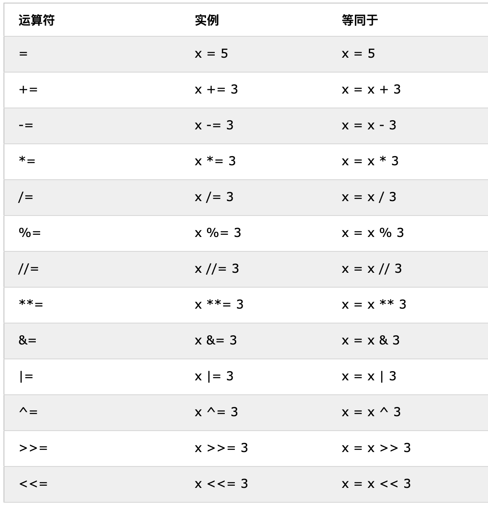
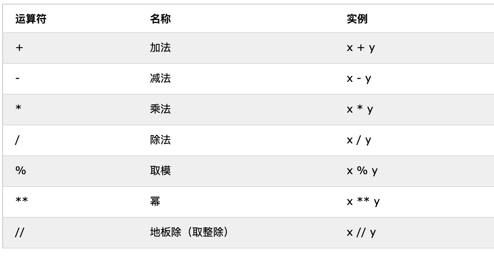
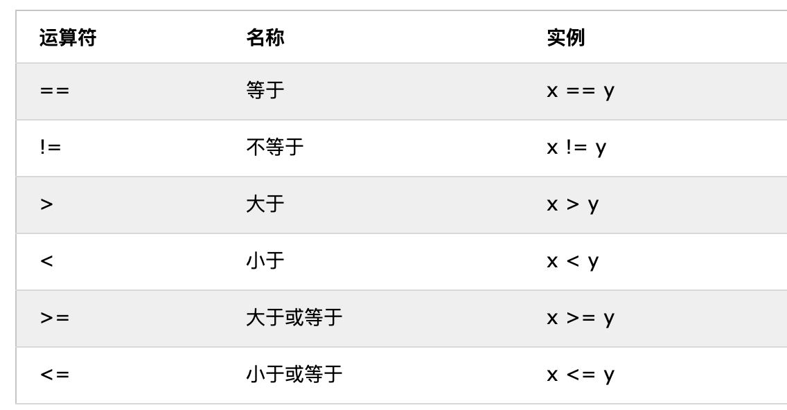
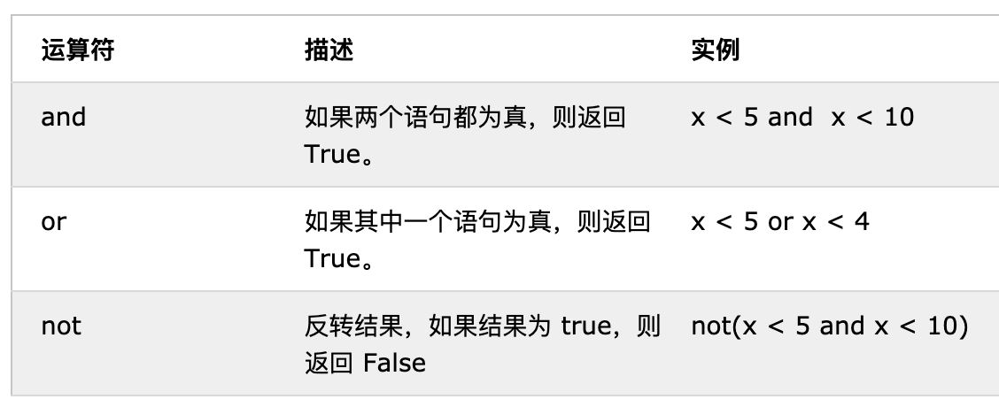

[<< Day 2](../02_Day_Variables_builtin_functions/02_variables_builtin_functions.md) | [Day 4 >>](../04_Day_Strings/04_strings.md)

- [📘 Day 3](#-day-3)
  - [布尔值](#布尔值)
  - [运算符](#运算符)
    - [赋值运算](#赋值运算)
    - [算数运算](#算数运算)
    - [比较运算](#比较运算)
    - [逻辑运算](#逻辑运算)
  - [💻 第3天练习](#-第3天练习)

# 📘 Day 3

> 🎉 本系列为Python基础学习，原稿来源于 [30-Days-Of-Python](https://github.com/Asabeneh/30-Days-Of-Python) 英文项目，大奇主要是对其本地化翻译、逐条验证和补充，想通过30天完成正儿八经的系统化实践。此系列适合零基础同学，或仅了解Python一点知识，但又没有系统学习的使用者。总之如果你想提升自己的Python技能，欢迎加入《挑战30天学完Python》

## 布尔值

布尔数据类型表示以下两个值之一：`True` 或 `False`。

请注意，与 JavaScript 不同Python中的布尔值首字要 **大写**。
 
```py
# 示例：布尔值
print(True)
print(False)
```

在比较两个值时，将对表达式求值，Python 返回布尔值答案，比较运算符下面就会讲到。

```py
print(10 > 9)  # True
print(10 == 9) # False
print(10 < 9)  # False
```

值得一提的是大多数值都为 `True`
- 如果有某种内容（如Object、Class），则几乎所有值都将评估为 True。
- 除空字符串外，任何字符串均为 True。
- 除 0 外，任何数字均为 True。
- 除空列表外，任何列表、元组、集合和字典均为 True。

以下实例都将返回 True

```py
bool("Hello")
bool(123456)
bool(["apple", "cherry", "banana"])
```

以下实例都将返回 False

```py
bool(False)
bool(None)
bool(0)
bool("")
bool(())
bool([])
bool({})
```
## 运算符

运算符用于对变量和值的执行操作。Python 语言支持多种类型的运算符，在本节将重点介绍其中的几个。

### 赋值运算

赋值运算符用于为变量赋值。我们以=为例。数学中的它表示两个值相等，但在 Python 则意味着将一个值存储在某个变量中，我们称之为赋值或给变量赋值。下表显示了不同类型的 python 赋值运算符，取自w3school。
📖[https://www.w3schools.cn/python/python_operators.asp](https://www.w3schools.cn/python/python_operators.asp)




### 算数运算

- 加法（+）：a + b
- 减法（-）：a - b
- 乘法（*）：a * b
- 除法（/）：a / b
- 求余（%）：a % b
- 求商（//）： a // b
- 求幂（**）：a ** b



**示例：整数**

```py
# Python中的算数运算
# 整数

print('加法Addition: ', 1 + 2)          # 3
print('减法Subtraction: ', 2 - 1)       # 1
print('求幂miMultiplication: ', 2 * 3)  # 6

# 在Python中除法得到结果是浮点类型
print('除法Division: ', 4 / 2)       # 2.0  
print('除法Division: ', 7 / 2)        # 3.5
print('求商: ', 7 // 2)               # 3
print('Division without the remainder: ',7 // 3)   # 2
print('求余Modulus: ', 3 % 2)         # 1
print('幂: ', 2 ** 3) # 8， 可理解为 2 * 2 * 2
```

**示例：浮点**

```py
# 浮点数
print('PI', 3.14)
print('gravity', 9.81)
```

**示例：复数**

```py
# 复数
print('Complex number: ', 1 + 1j)
print('Multiplying complex numbers: ',(1 + 1j) * (1 - 1j))
```

继续让我们声明一个变量并分配一个数字数据类型。笔者将使用单个字符变量，**但请记住不要养成声明此类变量的习惯。变量名应该始终便于记忆。**

代码例子1:

```python
# 首先在顶部声明变量

a = 3 # a是变量名，3是整数
b = 2 # b是变量名，2是整数

# 进行运算并将结果赋值给新的变量
total = a + b
diff = a - b
product = a * b
division = a / b
remainder = a % b
floor_division = a // b
exponential = a ** b

# 总数表示本应该用sum，但是它是pyhon的关键词，为了避免重复用了total代替
print('a + b = ', total)
print('a - b = ', diff)
print('a * b = ', product)
print('a / b = ', division)
print('a % b = ', remainder)
print('a // b = ', floor_division)
print('a ** b = ', exponential)
```

代码例子2:

```py
print('== Addition, Subtraction, Multiplication, Division, Modulus ==')

# 声明变量值，并将他们进行组合运算
num_one = 3
num_two = 4

# 算术运算
total = num_one + num_two
diff = num_two - num_one
product = num_one * num_two
div = num_two / num_one
remainder = num_two % num_one

# 打印计算后并赋值给新变量的值
print('total: ', total)
print('difference: ', diff)
print('product: ', product)
print('division: ', div)
print('remainder: ', remainder)
```

接着让我们利用学到的知识点，计算面积、体积、密度、重量、周长、距离、力等。

代码例子3:

```py
# 计算圆的面积
radius = 10                                 # 圆的半径
area_of_circle = 3.14 * radius ** 2         # 两个星(**)表示指数
print('Area of a circle:', area_of_circle)

# 计算矩形的面积
length = 10
width = 20
area_of_rectangle = length * width
print('Area of rectangle:', area_of_rectangle)

# 计算物体的重量
mass = 75
gravity = 9.81
weight = mass * gravity
print(weight, 'N')

# 计算液体的密度
mass = 75 # KG
volume = 0.075 # 立方米
density = mass / volume # 1000 Kg/m^3
```

### 比较运算

在编程中我们比较值时，使用比较运算符进行比较。即检查一个值是否大于或小于或等于其他值。



示例：比较运算符

```py
print(3 > 2)     # True, 因为 3 大于 2
print(3 >= 2)    # True, 因为 3 大于 2
print(3 < 2)     # False,  因为 3 大于 2
print(2 < 3)     # True, 因为 2 小于 3
print(2 <= 3)    # True, 因为 2 小于 3
print(3 == 2)    # False, 因为 3 不等于 2
print(3 != 2)    # True, 因为 3 确实不等于 2
print(len('mango') == len('avocado'))  # False
print(len('mango') != len('avocado'))  # True
print(len('mango') < len('avocado'))   # True
print(len('milk') != len('meat'))      # False
print(len('milk') == len('meat'))      # True
print(len('tomato') == len('potato'))  # True
print(len('python') > len('dragon'))   # False


# 比较两个对象并给出值
print('True == True: ', True == True)    # True
print('True == False: ', True == False)  # False
print('False == False:', False == False) # True
```

除了上面的比较操作符，在Python还使用这些:
- is：如果两个变量是同一个对象，则返回 true（x 是 y）
- is not：如果两个变量不是同一个对象（x 不是 y），则返回 true
- in：如果查询的列表包含某个项（x in y），则返回 True
- not in：如果查询的列表没有某个项（x in y），则返回 True

```py
print('1 is 1', 1 is 1)                   # True 
# 第一条 如果python shell 中运行此条会有个警告 （下面数值比较也类似）
# <stdin>:1: SyntaxWarning: "is" with a literal. Did you mean "=="?
# 忽略即可，也就是值比较的时候建议用==

print('1 is not 2', 1 is not 2)           # True
print('M in MegaQi', 'M' in 'MegaQi') # True
print('B in MegaQi', 'B' in 'MegaQi') # False 
print('coding' in 'coding for all') # True
print('a in an:', 'a' in 'an')      # True
print('4 is 2 ** 2:', 4 is 2 ** 2)   # True
```

### 逻辑运算

与其他编程语言不同，python 使用关键字and , or 和 not作为逻辑运算符。逻辑运算符用于组合条件语句：


```py
print(3 > 2 and 4 > 3) # True - because both statements are true
print(3 > 2 and 4 > 3) # True - 因为两个比较结果都是True
print(3 > 2 and 4 < 3) # False - 因为第二比较为False
print(3 < 2 and 4 < 3) # False - 因为两个比较都为False
print('True and True: ', True and True)
print(3 > 2 or 4 > 3)  # True - 因为两个比较结果都是True
print(3 > 2 or 4 < 3)  # True - 因为第一个表述为真
print(3 < 2 or 4 < 3)  # False - 因为两个比较表述都为假
print('True or False:', True or False)
print(not 3 > 2)     # False - 因为 3 > 2 是 true, 然后 True 反向为 False
print(not True)      # False - 反转操作  不为 true 则 false
print(not False)     # True
print(not not True)  # True
print(not not False) # False
```

🌕 你有无限的能量。你刚刚完成了第3天的挑战。按照惯例现在做一些练习来巩固下所学内容吧。

## 💻 第3天练习

1. 将你的年龄声明为整数变量
2. 将你的身高声明为浮点变量
3. 声明一个存储复数的变量
4. 编写一个脚本，提示用户输入三角形的底和高，并计算这个三角形的面积（面积 = 0.5 x 底 x 高）

```py
输入三角形底长 base: 20
输入三角形垂直高 height: 10
计算三角形面积是 100
```

5. 编写一个脚本，提示用户输入三角形的 a 边、b 边和 c 边。计算三角形的周长（周长 = a + b + c）

```py
输入边 a: 5
输入边 b: 4
输入边 c: 3
三角形周长计算得 12
```

6. 使用提示获取矩形的长度和宽度。计算它的面积（面积 = 长 x 宽）和周长（周长 = 2 x（长 + 宽））
7. 使用提示获取圆的半径。计算面积（面积 = pi * r * r）和周长（c = 2 * pi * r），其中 pi = 3.14
8. 计算y = 2x -2 的斜率，以及x截距和y截距
9. 斜率 k =(y2-y1)/(x2-x1) 求点(2,2)和点(6,10)之间的斜率K和欧氏距离（二维空间两点距离）
10. 比较练习题 8 和 9 的所得得斜率
11. 对于公式y = x^2 + 6x + 9 尝试x带入几个不同的值计算出y值，并找出x等于多少的时候y=0
12. 对字符串 "python" 和 "dragon" 计算出长度，并做一种运算使得结果等于False
13. 使用 and符号检查 "on" 是否同时存在"python"和"dragon"
14. 使用 in 符号检查字符串 jargon 是否存在 I hope this course is not full of jargon 这句话中
15. 实现运算符表达：字符串 "on" 都不存在 dragon 和 python
16. 计算字符串"python"的长度，并将其转成 float ，然后再转成字符串类型
17. 一个偶数是能被2整数余数为0，所以在python中如何判断一个是偶数还是奇数呢？
18. 检查以下 7 除以 2 转成 int 类型的值与 2.7 转成 int 的值是否相等
19. 检查 "10" 的类型 和 10 的类型是否相同(提示使用type)
20. 检查 int(9.8) 是否与等于 10
21. 写一个脚本，让用户输入工作时长（小时）和每小时的费用，计算应得的工资

```py
请输入时长(小时): 40
请输入时薪水: 28
您应得的费用为：1120
```

22. 写一个脚本，从用户输入得到N年，然后计算出总共有多少秒
23. 写一个Python脚本完成下边的表格打印

```py
1 1 1 1 1
2 1 2 4 8
3 1 3 9 27
4 1 4 16 64
5 1 5 25 125
```

🎉 CONGRATULATIONS ! 🎉

[<< Day 2](../02_Day_Variables_builtin_functions/02_variables_builtin_functions.md) | [Day 4 >>](../04_Day_Strings/04_strings.md)
