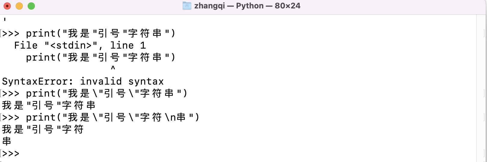

[<< Day 3](../03_Day_Operators/03_operators.md) | [Day 5 >>](../05_Day_Lists/05_lists.md)

- [📘 Day 4](#-day-4)
  - [字符串](#字符串)
    - [创建字符串](#创建字符串)
    - [字符串连接](#字符串连接)
    - [字符串转义](#字符串转义)
    - [字符串格式化](#字符串格式化)
    - [字符串作为字符序列](#字符串作为字符序列)
    - [字符串方法](#字符串方法)
  - [💻 第4天练习](#-第4天练习)

# 📘 Day 4

> 🎉 本系列为Python基础学习，原稿来源于 [30-Days-Of-Python](https://github.com/Asabeneh/30-Days-Of-Python) 英文项目，大奇主要是对其本地化翻译、逐条验证和补充，想通过30天完成正儿八经的系统化实践。此系列适合零基础同学，或仅了解Python一点知识，但又没有系统学习的使用者。总之如果你想提升自己的Python技能，欢迎加入《挑战30天学完Python》

## 字符串
文本就是字符串数据类型，任何数据类型写成文本形式都是字符串。被单引号(`''`),双引号(`""`) 或三个引号括起来的也都是字符串。在Python中有很多不同的方法和内置函数来处理字符串数据类型。其中检查字符串长度方法使用 `len()` 

### 创建字符串

```py
# 一个字符串可以是单个字符也是多个
letter = 'P' 
print(letter)               # P
print(len(letter))          # 1

# 字符串应该被单或双引号包裹 “Hello, Python”
greeting = 'Hello, Python!'
print(greeting)             # Hello, Python!
print(len(greeting))        # 14

sentence = "I hope you are enjoying 30 days of Python Challenge"
print(sentence)
```

多行字符串是通过使用三重单引号(''')或双引号(""")创建。

参考下面的例子：

```py
multiline_string = '''I am a teacher and enjoy teaching.
I didn't find anything as rewarding as empowering people.
That is why I created 30 days of python.'''
print(multiline_string)

# 另外一种方式做了同样的事情
multiline_string = """我是技术传播者，喜欢教学和分享.
我发现没有任何事情能比赋予人们知识更有意义.
那就是我为什打造“挑战30天学习完Python“的原因."""
print(multiline_string)
```

### 字符串连接

我们可以将字符串连接在一起，合并或者连接称之为字符串联。看下例子：

```py
first_name = 'Mega'
last_name = 'Qi'
space = ' '
full_name = first_name  +  space + last_name
print(full_name) # Meaga Qi

# 使用内置函数len()查看字符串长度
print(len(first_name))  # 4
print(len(last_name))   # 2
print(len(first_name) > len(last_name)) # True
print(len(full_name)) # 7
```

### 字符串转义
在Python和其他编程语言中，\ 后面跟一个字符是转义序列。让我们看看最常见的转义字符:
- \n: 换行
- \t: 制表符 (8 空格)
- \\\\: 反斜杠
- \': 单引号 (')
- \": 双引号 (")

这里补充下为啥有转义，因为像引号在上边说过是做为包裹字符文本使用的。如果想在一个字符串中使用这个引号字符就会导致处理错误。例如 `print("我是"引号"字符串")` 就无法正确识别字符串双引号开闭区间了。所以需要通过\转义来告诉程序这是不同的字符。



继续，先让我们看下使用转义字符的实际例子。

请自己在python shell 或者编辑器中编写代码执行。

```py
# 换行符
print('I hope everyone is enjoying the Python Challenge.\nAre you ?') 

# 添加制表符或四个空格
print('Days\tTopics\tExercises')  
print('Day 1\t5\t5')
print('Day 2\t6\t20')
print('Day 3\t5\t23')
print('Day 4\t1\t35')

# 字符串中带反斜杠
print('This is a backslash  symbol (\\)') 

# 字符串种使用双引号
print('In every programming language it starts with \"Hello, World!\"') 

# 输出结果
I hope every one is enjoying the Python Challenge.
Are you ?
Days	Topics	Exercises
Day 1	5	    5
Day 2	6	    20
Day 3	5	    23
Day 4	1	    35
This is a backslash  symbol (\)
In every programming language it starts with "Hello, World!"
```

### 字符串格式化

#### 旧式字符串格式化(%运算符)

在Python中有很多方式对字符串格式化操作。这这小节里我们将讲解其中一些。操作符“%”用于格式化包含在“元组”(固定大小的列表)中的一组变量。与包含普通文本和“参数说明符”的格式字符串一起使用。这些特殊符号有：

- %s - 字符
- %d - 整数
- %f - 浮点数
- "%.数字f" - 浮点数固定小数点后几位

```py
# 仅字符
name = 'MeagaQi'
language = 'Python'
formated_string = 'I am %s. I teach %s' %(name, language)
print(formated_string)

# 字符和数字
radius = 10
pi = 3.14
area = pi * radius ** 2
# 表示浮点后边保留两位小数
formated_string = 'The area of circle with a radius %d is %.2f.' %(radius, area) 

python_libraries = ['Django', 'Flask', 'NumPy', 'Matplotlib','Pandas']
formated_string = 'The following are python libraries:%s' % (python_libraries)
print(formated_string) 

# 输出结果
I am MeagaQi. I teach Python
The following are python libraries:['Django', 'Flask', 'NumPy', 'Matplotlib', 'Pandas']
```

#### 新式字符串格式化(str.format)

这个格式化方式在Python3中增加并使用。

```py

name = 'MegaQi'
language = 'Python'
formated_string = 'I am {}. I teach {}'.format(name, language)
print(formated_string)
# 输出
I am MegaQi. I teach Python

a = 4
b = 3
print('{} + {} = {}'.format(a, b, a + b))
print('{} - {} = {}'.format(a, b, a - b))
print('{} * {} = {}'.format(a, b, a * b))
print('{} / {} = {:.2f}'.format(a, b, a / b))
print('{} % {} = {}'.format(a, b, a % b))
print('{} // {} = {}'.format(a, b, a // b))
print('{} ** {} = {}'.format(a, b, a ** b))
# 输出
4 + 3 = 7
4 - 3 = 1
4 * 3 = 12
4 / 3 = 1.33
4 % 3 = 1
4 // 3 = 1
4 ** 3 = 64

# 字符和数字
radius = 10
pi = 3.14
area = pi * radius ** 2
formated_string = 'The area of a circle with a radius {} is {:.2f}.'.format(radius, area) # 2 digits after decimal
print(formated_string)
# 输出
The area of a circle with a radius 10 is 314.00.
```

#### 字符串插入/f-string格式化

另一种新的字符串格式化是插值。f-string是以字符串以f开头，然后将数据注入到相应的位置。 这种新方式是 Python 3.6 之后加入标准库的。官方文档描述说要比上边两种方式都快，因为 f-string 是运行时渲染的表达式，而不是常量值。

```py
a = 4
b = 3
print(f'{a} + {b} = {a +b}')       # 7
print(f'{a} - {b} = {a - b}')      # 1
print(f'{a} * {b} = {a * b}')      # 12
print(f'{a} / {b} = {a / b:.2f}')  # 1.33
print(f'{a} % {b} = {a % b}')      # 1
print(f'{a} // {b} = {a // b}')    # 1
print(f'{a} ** {b} = {a ** b}')    # 64
```

### 字符串作为字符序列

Python 字符串是字符序列，并与其他 Python 有序对象序列（列表和元组）共享它们的基本访问方法。从字符串中提取单个字符的最简单方法是将它们解包到相应的变量中。

#### 解包字符

```py
language = 'Python'
a,b,c,d,e,f = language # 将序列字符拆分到变量中
print(a) # P
print(b) # y
print(c) # t
print(d) # h
print(e) # o
print(f) # n
```

#### 索引访问

在程序中计数从零开始。因此字符串的第一个字母的下标为0，字符串的最后一个字母的长度是字符串的长度减1。


```py
language = 'Python'
first_letter = language[0]
print(first_letter) # P
second_letter = language[1]
print(second_letter) # y
last_index = len(language) - 1
last_letter = language[last_index]
print(last_letter) # n
```

如果我们想从右边开始，我们可以使用负索引。-1是最后一个索引。

```py
language = 'Python'
last_letter = language[-1]
print(last_letter) # n
second_last = language[-2]
print(second_last) # o
```

#### 字符串切片

在python中，我们可以将字符串切成子字符串。语法格式 `str[beginIndex:endIndex:step]`，并且取值结果为[begin,end) 半开区间即含头不含尾。步长不设置情况下默认为1。

```py
language = 'Python'
first_three = language[0:3] # 下角标从0开始到3，但不包括3，等同于language[0:3:1]
print(first_three) #Pyt
last_three = language[3:6]
print(last_three) # hon

# 切片时跳过字符串用法
step_str = language[0:5:2] # 表示中间各一个获取
print(step_str) # Pto 

# 其他一些处理方法
last_three = language[-3:] # 从倒数第3位开始到最后
print(last_three)   # hon
last_three = language[3:] # endIndex不设置默认到末尾
print(last_three)   # hon
```

#### 倒叙取值

在Python要对字符串进行倒序很容易。就是利用分片语法。

解释下例子：即表示将开始的值设置成最后一位，结束的值设置成第一位，反向从右到左。

```py
greeting = 'Hello, World!'
print(greeting[::-1]) 
print(greeting[-1::-1])
# !dlroW ,olleH
```

#### 切片时跳过字符

通过将step参数传递给slice方法，可以在切片时跳过字符。

```py
language = 'Python'
pto = language[0:6:2]
print(pto) # Pto
```

### 字符串方法

在Python中还有很多字符串方法来处理格式。以下将通过一些例子展示。

- `capitalize()`：将字符串的第一个字符转换为大写字母

```py
challenge = 'thirty days of python'
print(challenge.capitalize()) # 'Thirty days of python'
```

- `Count()`：返回字符串中给定字符出现次数。语法 count(substring, start=.., end=..)。其中start为开始索引，end为结束索引。

```py
challenge = 'thirty days of python'
print(challenge.count('y')) # 3
print(challenge.count('y', 7, 14)) # 1, 只统计索引范围7-14（不含14）内y的个数
print(challenge.count('th')) # 2
```

- `endswith()`：检查字符串是否以指定的结尾结束。
```py
challenge = 'thirty days of python'
print(challenge.endswith('on'))   # True
print(challenge.endswith('tion')) # False
```

- `expandtabs()`：方法把字符串中的 tab 符号 \t 转为空格，tab 符号 \t 默认的空格数是 8。在第 0、8、16...等处给出制表符位置，如果当前位置到开始位置或上一个制表符位置的字符数不足 8 的倍数则以空格代替。

```py
challenge = 'thirty\tdays\tof\tpython'
print(challenge.expandtabs())   # 'thirty  days    of      python'
print(challenge.expandtabs(10)) # 'thirty    days      of        python'
```

- `find()`：返回子字符串第一次出现的索引，如果没有找到则返回-1。

```py
challenge = 'thirty days of python'
print(challenge.find('y'))   # 5，thirty单词中第一出现的 y
print(challenge.find('th'))  # 0，thirty单词中第一出现的 th
print(challenge.find('ths')) # -1，整个字符串中没有出现连续的 ths 返回-1 表示没有找到
```

- `rfind()`：返回子字符串最后一次出现的索引，如果没有找到则返回-1。
```py
challenge = 'thirty days of python'
print(challenge.rfind('y'))  # 16，pyhton单词中最后出现的 y
print(challenge.rfind('th')) # 17，python单词中最后出现的 th
print(challenge.find('ths')) # -1
```

- `format()`：将字符串格格式化输出。次内容在上边详细讲过了，这里再举些例子。
```py
name = 'MegaQi'
age = 18
job = 'tester'
country = 'China'
sentence = 'I am {}. I am a {}. I am {} years old. I live in {}.'.format(name, age, job, country)
print(sentence) 
# 输出
# I am MegaQi. I am a 18. I am tester years old. I live in China.

radius = 10
pi = 3.14
area = pi * radius ** 2
result = 'The area of a circle with radius {} is {}'.format(str(radius), str(area))
print(result) 
# 输出
# The area of a circle with radius 10 is 314
```

- `index()`：返回给定值第一个匹配项的索引位置，函数形式index(x[, start[, end]]) ，其中附加参数可指定开始（默认0）和结束（默认-1）位置。如果子字符串没有匹配则抛出了ValueError异常。

> 区别说明：index()函数和find()函数功能类似。区别在于找不到的返回值不同，前者返回-1，后者异常ValueError: substring not found

``py
challenge = 'thirty days of python'
sub_string = 'da'
print(challenge.index(sub_string))  # 7
print(challenge.index(sub_string, 9)) # error
```

- `rindex()`: 返回给定值最后一个匹配项的索引位置，同样有扩展参数来制定查找开始和结束位置。函数使用参考上述。
```py
challenge = 'thirty days of python'
sub_string = 'da'
print(challenge.rindex(sub_string))  # 7
print(challenge.rindex(sub_string, 9)) # error
```

- `isalnum()`: 检查字符串是否仅为字符数字组合
```py
challenge = 'ThirtyDaysPython'
print(challenge.isalnum()) # True

challenge = '30DaysPython'
print(challenge.isalnum()) # True

challenge = 'thirty days of python'
print(challenge.isalnum()) # False, 空格不属于alphanumeric（字母数字）的组合

challenge = 'thirty days of python 2019'
print(challenge.isalnum()) # False

challenge = 'thirty@123'
print(challenge.isalnum()) # False
```

- `isalpha()`: 检查是否所有字符串元素都是字母字符(a-z和a-z)
```py
challenge = 'thirty days of python'
print(challenge.isalpha()) # False, 空格也不属于字母字符范畴

challenge = 'ThirtyDaysPython'
print(challenge.isalpha()) # True

num = '123'
print(num.isalpha())      # False
```

- `isdecimal()`: 检查字符串中的所有字符是否都是十进制(0-9)
```py
challenge = 'thirty days of python'
print(challenge.isdecimal())  # False

challenge = '123'
print(challenge.isdecimal())  # True

challenge = '\u00B2'
print(challenge.isdecimal())   # False 

challenge = '12 3'
print(challenge.isdecimal())  # False 注意有空字符所以不符合数字检查
```

- `isdigit()`: 检查字符串中的所有字符是否都是数字(0-9和一些用于数字的其他unicode字符)
```py
challenge = 'Thirty'
print(challenge.isdigit()) # False

challenge = '30'
print(challenge.isdigit())   # True

challenge = '\u00B2'
print(challenge.isdigit())   # True 如果你使用 print('\u00B2') 打印会看到输出是2
```

- `isnumeric()`: 检查字符串中的所有字符是否都是数字或与数字相关的（很像isdigit()，但接受更多的符号，比如½)
```py
num = '10'
print(num.isnumeric()) # True

num = '\u00BD' # print('\u00BD') = ½
print(num.isnumeric()) # True

num = '10.5'
print(num.isnumeric()) # False
```

- `isidentifier()`: 检查一个有效的标识符，即检查一个字符串是否是一个有效的变量名
```py
challenge = '30DaysOfPython'
print(challenge.isidentifier()) # False, 因为是数字开头不是一个有效的变量名，具体可回顾Day2：变量和内置函数

challenge = 'thirty_days_of_python'
print(challenge.isidentifier()) # Truec
```

- `islower()`: 检查字符串中的所有字母字符是否都是小写
```py
challenge = 'thirty days of python'
print(challenge.islower()) # True

challenge = 'Thirty days of python'
print(challenge.islower()) # False

challenge = '30天Python学习挑战'
print(challenge.islower()) # False 中文不是英文字母
```

- `isupper()`: 检查字符串中的所有字母字符是否都是大写
```py
challenge = 'thirty days of python'
print(challenge.isupper()) #  False

challenge = 'THIRTY DAYS OF PYTHON'
print(challenge.isupper()) # True
```

- `join()`: 返回一个连接后的字符串
```py
web_tech = ['HTML', 'CSS', 'JavaScript', 'React']

result1 = ' '.join(web_tech)
print(result1) # 'HTML CSS JavaScript React'

result2 = '# '.join(web_tech)
print(result2) # 'HTML# CSS# JavaScript# React
```

- `strip()`: 剔除开头和结尾符合指定字符，并返回新的字符串
```py
web_tech = ['HTML', 'CSS', 'JavaScript', 'React']

result1 = ' '.join(web_tech)
print(result1) # 'HTML CSS JavaScript React'

result2 = '# '.join(web_tech)
print(result2) # 'HTML# CSS# JavaScript# React
```

- `strip()`: 剔除开头和结尾符合指定字符，并返回新的字符串
```py
challenge = 'thirty days of pythoonnn'
print(challenge.strip('noth')) # 'irty days of py'
```

- `replace()`: 字符串替换

```py
challenge = 'thirty days of python'
print(challenge.replace('python', 'coding')) # 'thirty days of coding'
```

- `split()`: 字符串拆分, 使用给定的字符串或空格（不指定时候默认）字符
```py
challenge = 'thirty days of python'
print(challenge.split()) # ['thirty', 'days', 'of', 'python']

challenge = 'thirty, days, of, python'
# 注意对比下两个输出的区别
print(challenge.split(', ')) # ['thirty', 'days', 'of', 'python']
print(challenge.split(','))  # ['thirty', ' days', ' of', ' python']
```

- `title()`: 字符串中所有单词首字母大写
```py
challenge = 'thirty days of python'
print(challenge.title()) # Thirty Days Of Python
```

- `swapcase()`: 将字符串中所有大写字符转小写，反之小写转大写
```py
challenge = 'thirty days of python'
print(challenge.swapcase())   # THIRTY DAYS OF PYTHON

challenge = 'Thirty Days Of Python'
print(challenge.swapcase())  # tHIRTY dAYS oF pYTHON
```

- `startswith()`: 检查某字符串是否已某个特殊字符串值开始
```py
challenge = 'thirty days of python'
print(challenge.startswith('thirty')) # True

challenge = '30 days of python'
print(challenge.startswith('thirty')) # False

challenge = '挑战30天学完python'
print(challenge.startswith('挑战')) # True
```

> ✍️ 以上字符串方法很多，也都是简单举个例子，并没有展开讲，因为平常编程中常用的可能就几个，如split，replace，join，strip，index，find。所以不必纠结全部记住，也不要奢望看一次就会用。熟练在编程中使用一定是一种肌肉记忆。

🌕 你是一个具有非凡潜力的人。恭喜你已经完成第四天学习的挑战，在Python编程伟大的道路上前进了4步。趁热打铁让我们做一些练习巩固下吧。

## 第4天练习

1. 将这些单词字符 'Thirty', 'Days', 'Of', 'Python' 格式化输出一串字符 'Thirty Days Of Python'
2. 用不同的格式方式连接单字符串 'Coding', 'For' , 'All'  为'Coding For All'.
3. 声明一个变量名为 company 并初始化值为 "Coding For All"
4. 使用 print() 打印字符串变量 company 的值
5. 使用 len() 获取 company 字符串值的长度并输出 
6. 使用 upper() 函数将 company变量值全部转成大写
7. 使用 lower() 函数将 company变量值全部转成小写
8. 利用 capitalize(), title(), swapcase() 这三个方法函数对其字符串"coding for all"进行操作输出
9. 通过切片（slice）的方式，提取字符串 "Coding For All string" 第一个单词"Coding"
10. 使用index, find 或者其它方法，检查"Coding For All"是否包含指定的字符串
11. 字符串 'Coding For All' 将Coding替换成其他单词
12. 使用replace方法或其他方法将Python for Everyone更改为Python for All
13. 通过方法 split() 使用空格字符拆分 'Coding For All' 并输出
14. "Facebook, Google, Microsoft, Apple, IBM, Oracle, Amazon"通过逗号进行拆分
15. Coding For All 下角标为0的字符是什么？
16. Coding For All 最后索引的字符是什么？
17. Coding For All 索引10的字符是什么？
18. 将 'Python For Everyone' 首字母提取组成一个缩写并给一个新字符变量
19. 使用index找到字符 'C' 在 'Coding For All' 中第一次出现的位置
20. 使用index找到字符 'I' 在 'Coding For All People' 中最后次出现的位置
21. 使用index或find查找单词"because"在以下句子中第一出现的位置: 'You cannot end a sentence with because because because is a conjunction'
22. 使用rindex或rfind查找单词"because"在以下句子中最后一次出现的位置: 'You cannot end a sentence with because because because is a conjunction'
23. 从语句"You cannot end a sentence with because because because is a conjunction"中剔除出多余的 'because because because' 
24. 用一种方法分别找出第首次和最后一次出现 '因为' 的位置，语句：'你不能用因为因为因为来结束一个语句'
25. 检查“Coding For All”是否以子字符“Coding”开头
26. 检查“Coding For All”是否以子字符“Coding”结束
27. 移除'   Coding For All      '  左右两边的空格.
28. 以下哪句使用 isidentifier() 方法检查会返回True，并回忆它验证了什么？
● 30DaysOfPython
● thirty_days_of_python
29. 有一个包含python使用库名称列表。请使用join将其用空格连成一个字符串。
30. 使用换行转译符将一句话换行输出，最后的输出结果如下：
  ```sh
  I am enjoying this challenge.
  I just wonder what is next.
  ```
31. 使用制表符转义序列写出以下内容
  ```sh
  Name      Age     Country   City
  Asabeneh  250     Finland   Helsinki
  ```
32. 使用字符格式化方法显示一下内容：
  ```sh
  radius = 10
  area = 3.14 * radius ** 2
  The area of a circle with radius 10 is 314 meters square.
  ```
33. 使用格式化的方式计算和输出以下内容:
```sh
8 + 6 = 14
8 - 6 = 2
8 * 6 = 48
8 / 6 = 1.33
8 % 6 = 2
8 // 6 = 1
8 ** 6 = 262144
```

🎉 CONGRATULATIONS ! 🎉

[<< Day 3](../03_Day_Operators/03_operators.md) | [Day 5 >>](../05_Day_Lists/05_lists.md)