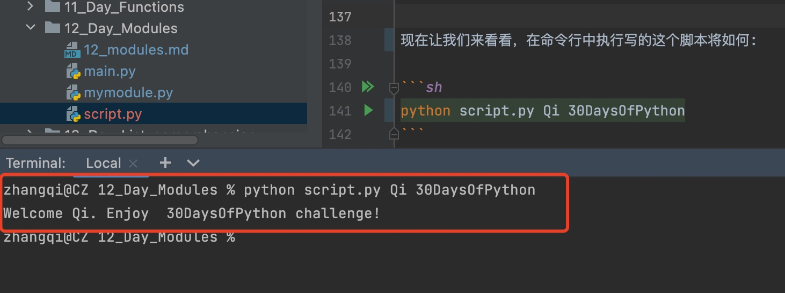

[<< Day 11](../11_Day_Functions/11_functions.md) | [Day 13>>](../13_Day_List_comprehension/13_list_comprehension.md)

- [📘 Day 12](#-day-12)
  - [模块Modules](#模块Modules)
    - [什么是模块](#什么是模块)
    - [创建Module](#创建Module)
    - [导入Module](#导入Module)
    - [从Module中导入函数](#从Module中导入函数)
    - [从模块导入函数并重命名](#从模块导入函数并重命名)
  - [导入内置模块](#导入内置模块)
    - [os 模块](#OS-模块)
    - [sys 模块](#sys-模块)
    - [statistics 模块](#statistics-模块)
    - [math 模块](#math-模块)
    - [字符串模块](#字符串模块)
    - [Random 模块](#Random-模块)
  - [💻 第12天练习](#-第12天练习)
    - [练习1级](#练习1级)
    - [练习2级](#练习2级)
    - [练习3级](#练习3级)

# 📘 Day 12

> 🎉 本系列为Python基础学习，原稿来源于 [30-Days-Of-Python](https://github.com/Asabeneh/30-Days-Of-Python) 英文项目，大奇主要是对其本地化翻译、逐条验证和补充，想通过30天完成正儿八经的系统化实践。此系列适合零基础同学，或仅了解Python一点知识，但又没有系统学习的使用者。总之如果你想提升自己的Python技能，欢迎加入《挑战30天学完Python》

## 模块Modules

### 什么是Module

模块是在应用程序中一个包含一组代码或一组函数的文件。模块可以是包含单个变量、函数或大型代码库的文件。

### 创建Module

要创建一个module我们在python脚本中写下我们的代码，并将它保存为 `.py` 的文件。现在让我们尝试在项目文件夹中创建一个名为`mymodule.py`的文件。让我们在这个文件中编写一些代码。
> 这份文件你也可以从项目源代码目录12_Day_Modules获取
```py
# mymodule.py
def generate_full_name(firstname, lastname):
    space = ' '
    fullname = firstname + space + lastname
    return fullname


def sum_two_nums(num1, num2):
    return num1 + num2


gravity = 9.81
person = {
    "name": "Qi",
    "age": 20,
    "country": "China",
    "city": 'ShangHai'
}
```
在你自己的项目中创建一个 main.py 文件，然后导入mymodule.py模块文件。

### 导入Module

要导入文件，我们只需使用 `_import_` 关键字加文件名即可。

```python
# main.py
import mymodule
print(mymodule.generate_full_name('Mega', 'Qi')) # Mega Qi
```

### 从Module中导入函数

在一个文件中兴许包含很多的函数方法，我们可以通过不同的方式进行导入。

```python
# main.py
from mymodule import generate_full_name, sum_two_nums, person, gravity
print(generate_full_name('Mega', 'Qi'))
print(sum_two_nums(1, 9))
mass = 100
weight = mass * gravity
print(weight)
print(person['name'])
```

### 从模块导入函数并重命名

在模块的导入的同时，我们也可以进行别名设置。

```python
# main.py file
from mymodule import generate_full_name as fullname, sum_two_nums as total, person as p, gravity as g

print(fullname('Mega', 'Qi'))
print(total(1, 9))
mass = 100
weight = mass * g
print(weight)
print(p)
print(p['name'])
```

## 导入内置模块

与其他编程语言一样可以导入内置模块，通过使用关键字 _import_ 导入文件/函数。现在让我们导入一些常用的模块。这些内置模块如：_math_, _datetime_, _os_,_sys_, _random_, _statistics_, _collections_, _json_, _re_

### os 模块

使用 python 中 `os` 模块可以自动执行许多系统操作。Python中的 OS 模块提供了诸如：创建、更改当前工作目录、删除目录(文件夹)、获取其内容、更改和标识当前目录等函数。

```python
# 导入os模块
import os
# 创建文件夹
os.mkdir('directory_name')
# 切换到当前刚才创建的directory_name文件夹
os.chdir('directory_name')
# 获取当前的工作路径目录
os.getcwd()
# 切换到上级目录
os.chdir('..')
# 删除文件夹
os.rmdir('directory_name')
```

### sys 模块

内置模块`sys`提供了一些python运行时环境操作的部分方法和变量。功能 sys.argv 获取传递给Python脚本命令行参数列表。列表索引 0 始终是文件的名，后边从1开始的是真正的命令行参数。

例子代码 script.py 文件:

```python
import sys
# print(sys.argv[0], argv[1],sys.argv[2])  
# 命令行执行将打印: 文件名 参数1 参数2
print('Welcome {}. Enjoy  {} challenge!'.format(sys.argv[1], sys.argv[2]))
```

现在让我们来看看，在命令行中执行写的这个脚本将如何:

```sh
python script.py Qi 30DaysOfPython
```

执行结果：


一些有用的sys命令:

```python
import sys
# 退出
sys.exit()

# python可以处理或存储为变量的最大值
sys.maxsize

# 获取系统配置环境变量
sys.path

# 获取当前python版本
sys.version
```
上边 maxsize 大小取决于系统：
- 32位：该值将为2^31-1，即2147483647
- 64位：该值将为2^63-1，即9223372036854775807

### statistics 模块

统计模块提供数值数据的数学统计功能。本模块中定义的常用统计函数: _mean_, _median_, _mode_, _stdev_ 等。  

```python
from statistics import * # 导入所有 statistics modules
ages = [20, 20, 4, 24, 25, 22, 26, 20, 23, 22, 26]
print(mean(ages))       # 算术平均值 21.09090909090909
print(median(ages))     # 方法返回数值数据的中值 22
print(mode(ages))       # 法计算给定数值或名义数据集的众数 20
print(stdev(ages))      # 计算标准差 6.106628291529549
```

### math 模块

此模块包含许多数学运算和常量。

```python
import math
print(math.pi)           # 3.141592653589793, 圆周率（Pi）常量
print(math.sqrt(2))      # 1.4142135623730951, 平方根
print(math.pow(2, 3))    # 8.0, 指数函数
print(math.floor(9.81))  # 9, 四舍五入取底
print(math.ceil(9.81))   # 10, 四舍五入取高
print(math.log10(100))   # 2.0, 以10为底的对数
```

现在，我们已经导入了 _math_ 模块，它包含了许多函数能帮助我们进行数学计算。那么如果要想查看模块都有那些函数，我们可以使用 _help(math)_ 或 _dir(math)_ 来显示模块中可用的函数。如果我们只想从模块中导入一个特定的函数，我们按如下方式导入它:

```python
from math import pi
print(pi)
```

同时也可以导入多个函数

```python
from math import pi, sqrt, pow, floor, ceil, log10
print(pi)
print(sqrt(2))
print(pow(2, 3))
print(floor(9.81))
print(ceil(9.81))
print(log10(100))
```
但如果我们想导入数学模块中的所有函数，我们可以使用 `*`。

```python
from math import *
print(pi)
print(sqrt(2))
print(pow(2, 3))
print(floor(9.81))
print(ceil(9.81))
print(log10(100))
```

同上导入时，还可以为函数设置别名。

```python
from math import pi as PI
print(PI)
```

### 字符串模块

字符串模块在很多方面都是非常有用的模块。下面的例子展示了字符串模块的一些用法。

```py
import string

# ascii字母
print(string.ascii_letters) # abcdefghijklmnopqrstuvwxyzABCDEFGHIJKLMNOPQRSTUVWXYZ

# 展示所有数字
print(string.digits)        # 0123456789

# 展示标点标点符号
print(string.punctuation)   # !"#$%&'()*+,-./:;<=>?@[\]^_`{|}~
```

### Random 模块

到目前为止，您已经熟悉了导入模块用法。让我们在导入另外一个模块来最后熟悉它。 模块 _random_ 它给返回一个0到0.9999之间的随机数。当然它有很多模块，但在本篇中只用到 _random_ 和 _randint_ 。

```python
from random import random, randint
print(random())   # 它返回一个介于0到0.9999之间的值
print(randint(5, 20)) # 它返回一个[5,20]的随机整数 
```

🌕 你已经坚持学习更高级的内容了。继续前进！你刚刚完成了第12天的挑战，你在通往伟大的道路上前进了12步。现在按例来做一些练习吧，来消化和巩固下学习成功。

## 💻 第12天练习

### 练习1级

1. 编写一个 random_user_id 函数，它的功能是随机生成6位字符（包括字母和数字）。
   ```pyton
     print(random_user_id());
     '1ee33d'
   ```
2. 修改上边方法。声明一个名为 user_id_gen_by_user 的函数。它不设置参数，但它使用input() 接受两个输入。其中一个输入是字符的数量，第二个输入是应该生成的id的数量。
   
    ```python
      print(user_id_gen_by_user()) # 用户输入: 5 5
      # 输出举例（因为是随机每次均不一样，所以以下值仅为举例）:
      #kcsy2
      #SMFYb
      #bWmeq
      #ZXOYh
      #2Rgxf
      
      print(user_id_gen_by_user()) # 16 5
      # 实际以你练习和输入的两个数为准
      #1GCSgPLMaBAVQZ26
      #YD7eFwNQKNs7qXaT
      #ycArC5yrRupyG00S
      #UbGxOFI7UXSWAyKN
      #dIV0SSUTgAdKwStr
    ```

3. 编写一个名为 rgb_color_gen 函数。它将生成rgb颜色(3个值，每个值从0到255)。
   
    ```python
    print(rgb_color_gen())
    # rgb(125,244,255) - 输出格式
    ```

### 练习2级
1. 编写一个函数 list_of_hexa_colors，它返回数组中任意数量的十六进制颜色(在#之后写入的六个十六进制数)。十六进制数字系统由16个符号组成，0-9和字母表的前6个字母a-f。
2. 编写一个函数 list_of_rgb_colors，它返回任意数量的RGB颜色数组。
3. 编写一个函数 generate_colors，它可以生成任意数量的hexa或rgb颜色。
    ```python
    generate_colors('hexa', 3) # ['#b0c6e9', '#c06ee9', '#871ff7'] 
    generate_colors('hexa', 1) # ['#3b2366']
    generate_colors('rgb', 3)  # ['rgb(85,243,216)', 'rgb(22,39,233)', 'rgb(235,151,123)']
    generate_colors('rgb', 1)  # ['rgb(221,103,205)']
    ```

### 练习3级

1. 调用你的编写的函数 shuffle_list，它接受一个列表作为参数，并返回一个打乱的列表。
2. 编写一个函数，返回由0-9范围内的7个随机数组成的数组。所有的数字必须是唯一的。

🎉 CONGRATULATIONS ! 🎉

[<< Day 11](../11_Day_Functions/11_functions.md) | [Day 13>>](../13_Day_List_comprehension/13_list_comprehension.md)
