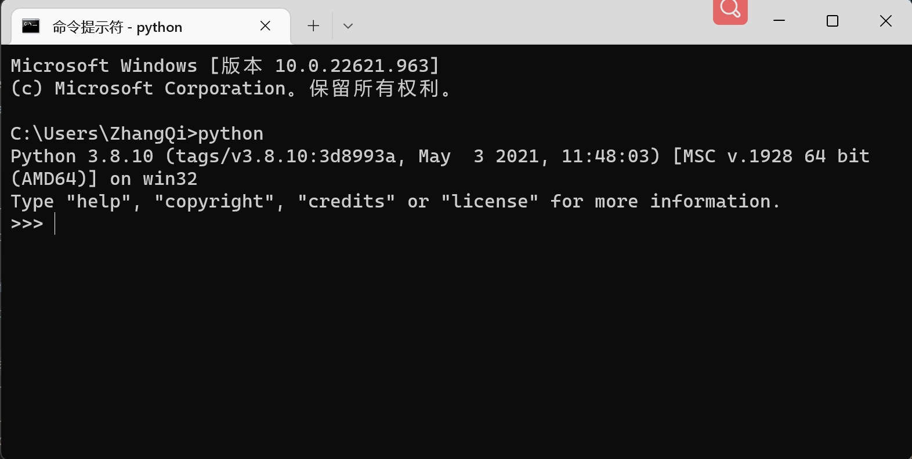

[<< Day 14](../14_Day_Higher_order_functions/14_higher_order_functions.md) | [Day 16 >>](../16_Day_Python_date_time/16_python_datetime.md)

- [📘 Day 15](#-day-15)
  - [Python错误类型](#Python错误类型)
    - [SyntaxError](#syntaxerror)
    - [NameError](#nameerror)
    - [IndexError](#indexerror)
    - [ModuleNotFoundError](#modulenotfounderror)
    - [AttributeError](#attributeerror)
    - [KeyError](#keyerror)
    - [TypeError](#typeerror)
    - [ImportError](#importerror)
    - [ValueError](#valueerror)
    - [ZeroDivisionError](#zerodivisionerror)
  - [💻 第15天练习](#-第15天练习)

# 📘 Day 15

## Python错误类型

当我们编写代码的时候，通常会出现些拼写错误或其他一些未知的错误。如果代码运行失败，Python解析器一般会报出相关的错误提示，其中包含了代码出错的行和错误类型。它有时候还会给出对应修复建议。了解编程语言中不同类型的错误将帮助我们快速调试代码，也使我们更好地完成我们的工作。

接下来，让我们来看一些在Python中常见的错误类型。首先让我们打开Python交互式终端。还记得如何打开吗？很简单，只需要在PC电脑上打开“终端”然后输入python即可进入Python交互模式。



### SyntaxError

SyntaxError表示语法错误。先看一个具体例子，请在控制台敲下如下 `print 'hello world'` 这句话：

```py
C:\Users>python
Python 3.8.10 (tags/v3.8.10:3d8993a, May  3 2021, 11:48:03) [MSC v.1928 64 bit (AMD64)] on win32
Type "help", "copyright", "credits" or "license" for more information.
>>> print 'hello world'
  File "<stdin>", line 1
    print 'hello world'
          ^
SyntaxError: Missing parentheses in call to 'print'. Did you mean print('hello world')?
>>>
```

上述的代码就出现了一个语法使用错误，因为在Python3+的版本里print打印需要括号，也可以看到在最后它给你出你的对应的提示。现在让我们按照正确的语法修复它。
As you can see we made a syntax error because we forgot to enclose the string with parenthesis and Python already suggests the solution. Let us fix it.

```py
>>> print('hello world')
hello world
>>>
```

错误的提示关键词是 _SyntaxError_. 按照提示修复后我们再次运行程序顺利通过。让我们继续看更多的错误类型。

### NameError

NameError表示名词错误，一般指变量命名。同样先看能出现此错误的例子：

```py
C:\Users\>python
Python 3.8.10 (tags/v3.8.10:3d8993a, May  3 2021, 11:48:03) [MSC v.1928 64 bit (AMD64)] on win32
Type "help", "copyright", "credits" or "license" for more information.
>>> print(age)
Traceback (most recent call last):
  File "<stdin>", line 1, in <module>
NameError: name 'age' is not defined
>>>
>>>
```

如你所看到的信息，变量名 age 没有被定义，但我们试图引用它并想打印出来，因此出现了一个 _NameError_ 错误提示。现在，让我们通过声明它并赋值来修复这个问题。

```py
>>> age = 18
>>> print(age)
18
>>>
```

错误类型为 _NameError_ 。我们通过定义变量名来解决错误。


### IndexError

IndexError表示索引错误，通常出现在list的下角标引用超出范围。

```py
>>> numbers = [1,2,3,4,5]
>>> numbers[5]
Traceback (most recent call last):
  File "<stdin>", line 1, in <module>
IndexError: list index out of rang
>>>
```

在上边的例子中，Python引发了一个 _IndexError_ 错误，因为定义的数字列表索引范围仅为0-4，因此最终程序抛出了索引超出范围错误。

### ModuleNotFoundError

ModuleNotFoundError 表示模块没有找到的错误。同样先来案例：

```py
C:\Users\>python
Python 3.8.10 (tags/v3.8.10:3d8993a, May  3 2021, 11:48:03) [MSC v.1928 64 bit (AMD64)] on win32
Type "help", "copyright", "credits" or "license" for more information.
>>> import maths
Traceback (most recent call last):
  File "<stdin>", line 1, in <module>
ModuleNotFoundError: No module named 'maths'
>>>
```

在这个例子中，我想导入一个外部的 `math` 库，但我打成maths也就是说它实际上是不存在的。因此发生了没有此模块的 _ModuleNotFoundError_ 错误。现在让我们来修复它。

```py
>>> import math
>>> math.sqrt(9) # 返回9的平方根
3.0
>>>
```

我们修了数学计算的模块的引用。因此我们就可以继续做后边方法引用了。

### AttributeError

AttributeError表示属性错误。一般是某个声明的对象没有此属性，但却被引用进而引发的错误。

```py
>>> import math
>>> math.PI
Traceback (most recent call last):
  File "<stdin>", line 1, in <module>
AttributeError: module 'math' has no attribute 'PI'
>>>
```
如你所见，我又犯了一个错误！我尝试从数学模块调用pi函数，而不是pi。因此会引发一个AttributeError错误，这意味着该函数在模块中不存在。我们将PI改成pi来修正它。

```py
>>> import math
>>> math.pi
3.141592653589793
>>>
```

现在，我们从math模块中正确使用属性，因此我们得到圆周率的结果。

### KeyError

KeyError表示关键词错误。

```py
C:\Users>python
Python 3.8.10 (tags/v3.8.10:3d8993a, May  3 2021, 11:48:03) [MSC v.1928 64 bit (AMD64)] on win32
Type "help", "copyright", "credits" or "license" for more information.
>>> users = {'name':'Asab', 'age':250, 'country':'Finland'}
>>> users['name']
'Asab'
>>> users['conty']
Traceback (most recent call last):
  File "<stdin>", line 1, in <module>
KeyError: 'conty'
>>>
```

可以看到，在通过key获取字典的时候，我拼错了关键词。因此出现了关键词使用错误。程序出错，我们就必须修复它。

```py
>>> users = {'name':'Asab', 'age':250, 'country':'Finland'}
>>> users['conty']
Traceback (most recent call last):
  File "<stdin>", line 1, in <module>
KeyError: 'conty'
>>> users['country']
'Finland'
>>>
```

我们通过调试修复了KeyError错误，进而我们程序可以正常运行了。

### TypeError

TypeError表示类型错误。请先回顾下我们之前都学了哪些类型。如果这些乱用会出现一些什么情况呢？

```py
>>> 4 + '3'
Traceback (most recent call last):
  File "<stdin>", line 1, in <module>
TypeError: unsupported operand type(s) for +: 'int' and 'str'
>>>
```

在上面的例子中，出现了TypeError错误，因为我们不能将字符串与数字进行相加。第一个解决方案是将字符串转换为int或float。另一种解决方案是将数字转换为字符串，但结果是字符串的连接结果会变成'43'，这不是我们想要的逻辑结果。因此让我们选择第一种方法修复这个错误。

```py
>>> 4 + int(3)
7
>>> 4 + float('3')
7.0
>>>
```

错误被消除，我们得到了我们期望的结果。

### ImportError

ImportError表示导入或引入错误。

```py
C:\Users>python
Python 3.8.10 (tags/v3.8.10:3d8993a, May  3 2021, 11:48:03) [MSC v.1928 64 bit (AMD64)] on win32
Type "help", "copyright", "credits" or "license" for more information.
>>> from math import power
Traceback (most recent call last):
  File "<stdin>", line 1, in <module>
ImportError: cannot import name 'power' from 'math' (unknown location)
>>>
```

因为在数学模块中没有名为 power 的函数，所以它引起了一个 ImportError错误。通过手册查询或者打印内置函数，可以看到正确函数应该是 _pow_。让我们来纠正一下:

```py
>>> import math
>>> dir(math)
['__doc__', '__loader__', '__name__', '__package__', '__spec__', 'acos', 'acosh', 'asin', 'asinh', 'atan', 'atan2', 'atanh', 'ceil', 'comb', 'copysign', 'cos', 'cosh', 'degrees', 'dist', 'e', 'erf', 'erfc', 'exp', 'expm1', 'fabs', 'factorial', 'floor', 'fmod', 'frexp', 'fsum', 'gamma', 'gcd', 'hypot', 'inf', 'isclose', 'isfinite', 'isinf', 'isnan', 'isqrt', 'ldexp', 'lgamma', 'log', 'log10', 'log1p', 'log2', 'modf', 'nan', 'perm', 'pi', 'pow', 'prod', 'radians', 'remainder', 'sin', 'sinh', 'sqrt', 'tan', 'tanh', 'tau', 'trunc']
>>> from math import pow
>>> pow(2,3)
8.0
>>>
>>>
```

### ValueError

ValueError 值错误

```py
>>> int('12a')
Traceback (most recent call last):
  File "<stdin>", line 1, in <module>
ValueError: invalid literal for int() with base 10: '12a'
>>>
```

在这个例子中，我们不能将一个带有字符的字符串转成数字，否则它就抛出一个值转换错误。

### ZeroDivisionError

ZeroDivisionError 分母为零错误。在数学里我们知道如果一个数字除以0是不允许的。程序里也一样它会报错。

```py
>>> 1/0
Traceback (most recent call last):
  File "<stdin>", line 1, in <module>
ZeroDivisionError: division by zero
>>>
```

一个数不能被0除，所以上边例子给出了 _ZeroDivisionError_ 错误。

至此，我们介绍了一些常见的错误类型，如果你想了解更多的。请查看python官方有关错误类型这部分的文档。如果你能熟练掌握错误的类型由来，那你在遇到错误的时候就能很快根据提示修复程序。这将祝你成为一个更好的程序员。

🌕 你如此优秀。在通往伟大的路上已经走了一半的路程了。本次没有额外的作业，但如果上边的例子，你并没有亲自尝试，那么请你把他们当作练习完成错误见证和debug修复它们。Y

## 💻 第15天练习

1. 打开python交互式shell并练习本节中介绍的所有示例。

🎉 CONGRATULATIONS ! 🎉

[<< Day 14](../14_Day_Higher_order_functions/14_higher_order_functions.md) | [Day 16 >>](../16_Day_Python_date_time/16_python_datetime.md)