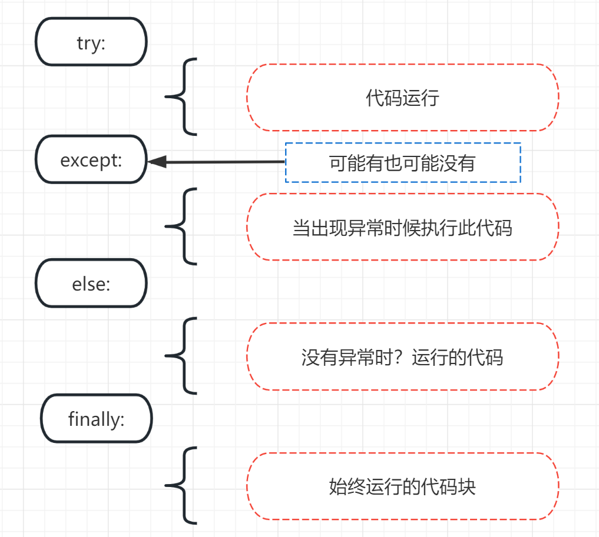

[<< Day 16](../16_Day_Python_date_time/16_python_datetime.md) | [Day 18 >>](../18_Day_Regular_expressions/18_regular_expressions.md)

- [📘 Day 17](#-day-17)
  - [异常处理](#exception-handling)
  - [Python参数打包和解包](#Python参数打包和解包)
    - [解包](#解包)
      - [解包列表 list](#解包列表-list)
      - [解包字典 dict](#解包字典-dict)
    - [打包](#打包)
      - [打包列表 list](#打包列表-list)
      - [打包列表 dict](#打包列表-dict)
  - [Python中Spread](#Python中Spread)
  - [枚举](#枚举)
  - [打包 zip](#打包-zip)
  - [第17天练习](#第17天练习)

# 📘 Day 17

## 异常处理

Python 使用 _try_ 和 _except_ 来优雅的处理异常。优雅地退出（或捕获）错误是一种简单的编程习惯，即程序检测到严重的错误条件时会以受控的方式“优雅地退出”。通常程序将描述性错误消息打印到终端或日志中作为优雅退出的一部分，这使得应用程序更加的健壮。通常程序的异常可能由外部原因引起。一个异常例外可能是错误的输入，错误的文件名，文件无法找到或IO设备故障等。优雅的捕获和处理这些异常可以防止应用的崩溃。

在上一篇中我们介绍的不同错误类型。如果在程序我们合理的使用了 _try_ 和 _except_，那么程序将不会因这些程序块错误而导致运行崩溃。



```py
try:
    # 如果一切顺利，代码将在这里执行完毕
    code in this block if things go well
except:
    # 如果try代码出现错误将跳转到这里执行此处代码
    code in this block run if things go wrong
```

**例子1:**

```py
try:
    print(10 + '5')
except:
    print('Something went wrong')
```

在例子1中，第二个参数是个字符串，程序会报 `TypeError: unsupported operand type(s)` 错误。我们可以将其转换为int或float类型让其程序正常工作。但如果不做任何的处理，则 _except_ 块将被执行。

**例子2:**

```py
try:
    name = input('Enter your name:')
    year_born = input('Year you were born:')
    age = 2019 - year_born
    print(f'You are {name}. And your age is {age}.')
except:
    print('Something went wrong')
```
输出
```sh
Something went wrong
```

在例子2中，except代码块被运行了，但我们可能不知道具体错误问题。为了分析这个异常，我们可以使用except不同的错误类型类处理。

在下边的例子中，它会处理根据不同错误类型进行处理。

```py
try:
    name = input('Enter your name:')
    year_born = input('Year you were born:')
    age = 2019 - year_born
    print(f'You are {name}. And your age is {age}.')
except TypeError:
    print('Type error occured')
except ValueError:
    print('Value error occured')
except ZeroDivisionError:
    print('zero division error occured')
```

```sh
Enter your name: MegaQi
Year you born: 1987
Type error occured
```

在上边的例子中输出的是 _TypeError_。现在让我们来优化下代码，并且添加开头图片中异常逻辑中其他两个额外的代码块。

```py
import datetime

try:
    name = input('Enter your name:')
    year_born = input('Year you born:')
    age = datetime.datetime.now().year - int(year_born)
    print(f'You are {name}. And your age is {age}.')
except TypeError:
    print('Type error occur')
except ValueError:
    print('Value error occur')
except ZeroDivisionError:
    print('zero division error occur')
else:
    print('I usually run with the try block')
finally:
    print('I alway run.')
```

输出

```sh
Enter your name:MegaQi
Year you born:1987
You are MegaQi. And your age is 36.
I usually run with the try block
I alway run.
```

你也可以使用短捕获方式（不分类型处理所有异常）请参考:
```py
import datetime

try:
    name = input('Enter your name:')
    year_born = input('Year you born:')
    age = datetime.datetime.now().year - int(year_born)
    print(f'You are {name}. And your age is {age}.')
except Exception as e:
    print(e)

```

## Python参数打包和解包

我们使用两种操操作符

- \* 表示任意数量的位置参数
- \*\* 表示任意数量的关键字参

下面举一个例子。它仅需要参数但我们有列表。我们可以解压缩列表并对参数进行更改。

### 解包

#### 解包列表 list

```py
def sum_of_five_nums(a, b, c, d, e):
    return a + b + c + d + e

lst = [1, 2, 3, 4, 5]
print(sum_of_five_nums(lst)) # TypeError: sum_of_five_nums() missing 4 required positional arguments: 'b', 'c', 'd', and 'e'
```

当我们运行这段代码时，它会引发一个错误，因为这个函数以数字而不是列表作为参数。让我们来看下如果用解包的方式优化程序。

```py
def sum_of_five_nums(a, b, c, d, e):
    return a + b + c + d + e

lst = [1, 2, 3, 4, 5]
print(sum_of_five_nums(*lst))  # 15
```

我们还可以使用 _range_ 内置函数中实现解包，该函数需要开始和结束两个值。

```py
numbers = range(2, 7)   # 带有单独参数的正常调用
print(list(numbers))    # [2, 3, 4, 5, 6]
args = [2, 7]
numbers = range(*args)  # 使用从列表中解包的参数调用
print(list(numbers))    # [2, 3, 4, 5,6]

```

列表或元组也可以像这样解包：

```py
countries = ['Finland', 'Sweden', 'Norway', 'Denmark', 'Iceland']
fin, sw, nor, *rest = countries  # *rest 将后两个国家打包成一个list
print(fin, sw, nor, rest)        # Finland Sweden Norway ['Denmark', 'Iceland']

numbers = [1, 2, 3, 4, 5, 6, 7]
one, *middle, last = numbers     # 前后两个赋值给前后两个变量，中间剩余全部打包成list
print(one, middle, last)         #  1 [2, 3, 4, 5, 6] 7
```

#### 解压字典 dict

```py
def unpacking_person_info(name, country, city, age):
    return f'{name} lives in {country}, {city}. He is {age} year old.'

dct = {'name':'MegaQi', 'country':'China', 'city':'ShangHai', 'age':18}
print(unpacking_person_info(**dct))   # MegaQi lives in China, ShangHai. He is 18 year old.
```

以上方法将字典作为打包参数传给方法的时候，方法参数就会将变量名作为key自动解包。

### 打包

有时我们不知道需要传递多少参数给一个python函数。我们可以使用打包方法来允许函数接受无限或任意数量的参数。

### 打包列表 list

```py
def sum_all(*args):
    s = 0
    for i in args:
        s += i
    return s
print(sum_all(1, 2, 3))             # 6
print(sum_all(1, 2, 3, 4, 5, 6, 7)) # 28

```

#### 打包字典 dict

```py
def packing_person_info(**kwargs):
    for key in kwargs:
        print(f"{key} = {kwargs[key]}")
    return kwargs

print(packing_person_info(name="MegaQi",country="China", city="ShangHai", age=18))
```

```sh
name = MegaQi
country = China
city = ShangHai
age = 18
{'name': 'MegaQi', 'country': 'China', 'city': 'ShangHai', 'age': 18}
```

## Python中Spread

像在JavaScript中一样，在Python可以进行延展操作。让我们看下面的例子:

```py
lst_one = [1, 2, 3]
lst_two = [4, 5, 6, 7]
lst = [0, *lst_one, *lst_two]
print(lst)          # [0, 1, 2, 3, 4, 5, 6, 7]

country_lst_one = ['Finland', 'Sweden', 'Norway']
country_lst_two = ['Denmark', 'Iceland']
nordic_countries = [*country_lst_one, *country_lst_two]
print(nordic_countries)  # ['Finland', 'Sweden', 'Norway', 'Denmark', 'Iceland']
```

## 枚举

如果我们对列表的索引感兴趣，我们使用 *enumerate* 内置函数来获取列表中每一项索引。

**例子 1：**
```py
for index, item in enumerate([20, 30, 40]):
    print(index, item)
```
输出
```
0 20
1 30
2 40
```

**例子 2：**
```py
countries = ['Finland', 'Sweden', 'Norway', 'Denmark', 'Iceland']
for index, i in enumerate(countries):
    if i == 'Finland':
        print(f'The country {i} has been found at index {index}')
```
输出
```sh
The country Finland has been found at index 0
```

## 打包 zip

`zip()` 函数用于将可迭代的对象作为参数，将对象中对应的元素打包成一个个元组，然后返回由这些元组组成的列表。

有时我们希望在循环遍历列表时合并它们。请看下面的例子:

```py
fruits = ['banana', 'orange', 'mango', 'lemon', 'lime']                    
vegetables = ['Tomato', 'Potato', 'Cabbage','Onion', 'Carrot']
zip_fruits_and_veges = zip(fruits, vegetables)
print(list(zip_fruits_and_veges))  # [('banana', 'Tomato'), ('orange', 'Potato'), ('mango', 'Cabbage'), ('lemon', 'Onion'), ('lime', 'Carrot')]

fruits_and_veges = []
for f, v in zip(fruits, vegetables):
    fruits_and_veges.append({'fruit':f, 'veg':v})  

print(fruits_and_veges)
```

```sh
[('banana', 'Tomato'), ('orange', 'Potato'), ('mango', 'Cabbage'), ('lemon', 'Onion'), ('lime', 'Carrot')]
[{'fruit': 'banana', 'veg': 'Tomato'}, {'fruit': 'orange', 'veg': 'Potato'}, {'fruit': 'mango', 'veg': 'Cabbage'}, {'fruit': 'lemon', 'veg': 'Onion'}, {'fruit': 'lime', 'veg': 'Carrot'}]
```

🌕 你是如此有毅力。你已经完成第17天的课程学习。让我们简单做个小练习吧。 

## 第17天练习

1. 解压缩前五个国家并将它们存储在一个变量 nordic_nations 中，将Estonia和Russia分别存储在es和ru中。
    ``` py
    names = ['Finland', 'Sweden', 'Norway','Denmark','Iceland', 'Estonia','Russia']
    ```

🎉 CONGRATULATIONS ! 🎉

[<< Day 16](../16_Day_Python_date_time/16_python_datetime.md) | [Day 18 >>](../18_Day_Regular_expressions/18_regular_expressions.md)