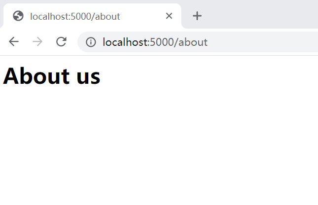
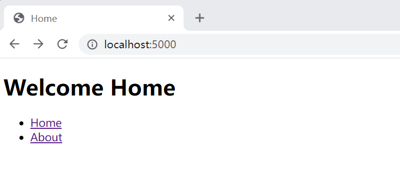
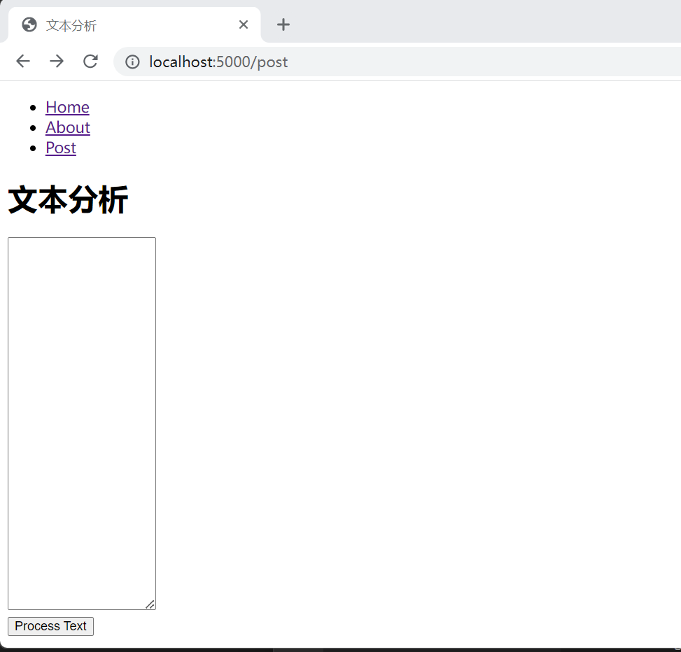
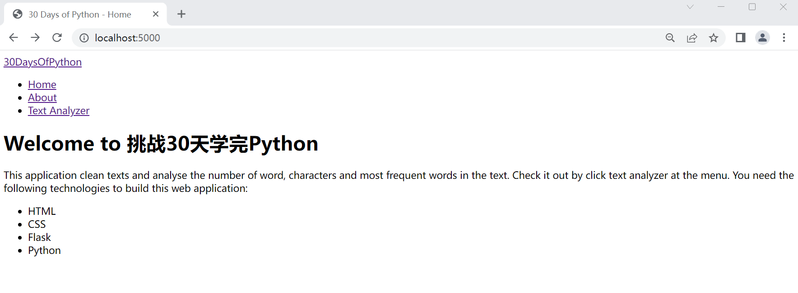

[<< Day 25 ](../25_Day_Pandas/25_pandas.md) | [Day 27 >>](../27_Day_Python_with_mongodb/27_python_with_mongodb.md)


- [📘 Day 26](#-day-26)
  - [Python Web 服务](#Python-Web-服务)
    - [Flask](#flask)
      - [项目结构](#项目结构)
    - [配置项目目录](#配置项目目录)
    - [创建路由](#创建路由)
    - [创建 templates](#创建-templates)
    - [Python Web优化](#Python Web优化)
    - [导航](#导航)
    - [通用布局](#通用布局)
      - [静态服务文件](#静态服务文件)
    - [部署](#部署)
  - [第26天练习](#第26天练习)

# 📘 Day 26

## Python Web 服务

Python本身是一种通用的语言，可以用于很多的地方。在本篇中，我们将看到如何在Web开发中使用Python。它有很多的web架构框架。Django和Flask是比较流行。接下来我们就看看如何使用Flask进行web的开发。

### Flask

Flask是一个用Python编写的web开发框架。Flask使用Jinja2模板引擎。Flask也可以与其他现代前端库(如React\VUE)一起使用。

如果您还没有安装virtualenv包，请先安装它。我们将在虚拟环境中进行项目依的隔离开发。

#### 项目结构

在稍后完成所有步骤后，你的项目文件结构应该是这样的:

```sh
├── app.py
├── env
│   ├── bin
├── static
│   └── css
│       └── main.css
└── templates
    ├── about.html
    ├── home.html
    ├── layout.html
    ├── post.html
    └── result.html
```

### 配置项目目录

按照以下步骤开始使用Flask。

**步骤 1:** 安装virtualenv。

```sh
pip install virtualenv
```

**步骤 2:** 创建项目目录并安装依赖

```sh
# window powershell 上的操作记录
> mkdir python_for_web
> cd .\python_for_web\
> virtualenv venv
# source venv/bin/activate
> .\venv\Scripts\activate.ps1
> pip freeze
> pip install Flask
> pip freeze

click==8.1.3
colorama==0.4.6
Flask==2.2.3
importlib-metadata==6.1.0
itsdangerous==2.1.2
Jinja2==3.1.2
MarkupSafe==2.1.2
Werkzeug==2.2.3
zipp==3.15.0
```
我们创建了一个名为 python_for_web的项目文件夹。并且在项目中创建了一个虚拟 *venv* 环境，然后我们激活虚拟环境。接着使用pip freeze来检查项目目录中已安装的包。最后安装Flask，并且再次检查此环境中包安装的情况。

现在，让我们在项目目录中创建一个 *app.py* 文件，并编写以下代码。app.py将是项目中的主文件。代码中会有flask模块和os模块。

### 创建路由

创建主路由。这其中如果你一点也不了解web服务和接口http协议的话，请自行先花点时间去了解下，否则你接下来的一些学习内容会很难。

```py
# 导入框架模块 flask
from flask import Flask
import os

app = Flask(__name__)

@app.route('/') # 通过这个装饰器创建主(跟)路由
def home ():
    return '<h1>Welcome</h1>'

if __name__ == '__main__':
    # 部署运行
    port = int(os.environ.get("PORT", 5000))
    app.run(debug=True, host='0.0.0.0', port=port)
```

要运行flask应用程序，请在flask应用程序主目录执行 python app.py 或者通过IDE快速启动。

运行_python app.py_后，检查本地主机5000。
```sh
> curl localhost:5000
<h1>Welcome</h1>
```

让我们再加一条路线，比如创建 */about* 路由。

```py
from flask import Flask
import os 

app = Flask(__name__)

@app.route('/') 
def home ():
    return '<h1>Welcome</h1>'

@app.route('/about') # 创建一个关于路由
def about():
    return '<h1>About us</h1>'

if __name__ == '__main__':
    port = int(os.environ.get("PORT", 5000))
    app.run(debug=True, host='0.0.0.0', port=port)
```

现在，我们在上面的代码中添加了about路由，重新运行app.py，然后这次我们通过浏览器请求看下响应。


如果想渲染HTML文件而不是字符串呢？我们可以使用 *render_templae* 函数渲染HTML文件。让我们创建一个名为 templates 的文件夹，并在项目目录中创建 home.html 和 about.html 两个网页文件。这里需要从flask再导入 *render_template* 函数。

### 创建 templates

在templates文件夹中创建HTML文件。HTML不熟的可以直接拷贝两个代码创建两个网页文件。

home.html

```html
<!DOCTYPE html>
<html lang="en">
  <head>
    <meta charset="UTF-8" />
    <meta name="viewport" content="width=device-width, initial-scale=1.0" />
    <title>Home</title>
  </head>

  <body>
    <h1>Welcome Home</h1>
  </body>
</html>
```

about.html

```html
<!DOCTYPE html>
<html lang="en">
  <head>
    <meta charset="UTF-8" />
    <meta name="viewport" content="width=device-width, initial-scale=1.0" />
    <title>About</title>
  </head>

  <body>
    <h1>About Us</h1>
  </body>
</html>
```

### Python Web优化

在 app.py 代码路由代码中直接改成返回HTML模板。

```py
# 导入框架模块 flask
from flask import Flask, render_template
import os

app = Flask(__name__)

@app.route('/') # 通过这个装饰器创建主(跟)路由
def home ():
    return render_template('home.html')

@app.route('/about')
def about():
    return render_template('about.html')


if __name__ == '__main__':
    # 部署运行
    port = int(os.environ.get("PORT", 5000))
    app.run(debug=True, host='0.0.0.0', port=port)
```

打开浏览器访问 http://localhost:5000/ 或 http://localhost:5000/about 查看效果。

如你所见，访问不同的页面或导航，我们需要一个route。接下来让我们新增一个导航页，用于链接跳转到不同的页面。

### 导航

让我在 home.html 的body里增加如下代码：


```
<ul>
  <li><a href="/">Home</a></li>
  <li><a href="/about">About</a></li>
</ul>
```

现在，我们可以使用上面的链接在页面之间导航。


继续丰富Web服务，让我们创建一个能处理表单数据的页面。你可以叫它任何名字，这里我取名为 *post.html* 。

我们可以使用 *Jinja2* 模板引擎向HTML文件中注入数据。也就是要传递参数，想来改造app.py
```py
# let's import the flask
from flask import Flask, render_template, request, redirect, url_for
import os # importing operating system module

app = Flask(__name__)

@app.route('/') # this decorator create the home route
def home ():
    techs = ['HTML', 'CSS', 'Flask', 'Python']
    name = '30 Days Of Python Programming'
    return render_template('home.html', techs=techs, name = name, title = 'Home')

@app.route('/about')
def about():
    name = '30 Days Of Python Programming'
    return render_template('about.html', name = name, title = 'About Us')

@app.route('/post')
def post():
    name = 'Text Analyzer'
    return render_template('post.html', name = name, title = name)


if __name__ == '__main__':
    # for deployment
    # to make it work for both production and development
    port = int(os.environ.get("PORT", 5000))
    app.run(debug=True, host='0.0.0.0', port=port)
```

在html代码中通过{{key}}来获取python程序中给定的参数值，三个页面的代码参考如下：

home.html

```html
<!DOCTYPE html>
<html lang="en">
  <head>
    <meta charset="UTF-8" />
    <meta name="viewport" content="width=device-width, initial-scale=1.0" />
    <title>{{title}}</title>
  </head>

  <body>
    <ul>
      <li><a href="/">Home</a></li>
      <li><a href="/about">About</a></li>
      <li><a href="/post">Post</a></li>
    </ul>
    <h1>Welcome to {{name}}</h1>
     <ul>
    
      <li>{{tech}}</li>
    
    </ul>
  </body>
</html>
```

about.html

```html
<!DOCTYPE html>
<html lang="en">
  <head>
    <meta charset="UTF-8" />
    <meta name="viewport" content="width=device-width, initial-scale=1.0" />
    <title>{{title}}</title>
  </head>

  <body>
    <ul>
      <li><a href="/">Home</a></li>
      <li><a href="/about">About</a></li>
      <li><a href="/post">Post</a></li>
    </ul>
    <h1>About Us</h1>
    <h2>{{name}}</h2>
  </body>
</html>
```

post.html

```html
<!DOCTYPE html>
<html lang="en">
  <head>
    <meta charset="UTF-8" />
    <meta name="viewport" content="width=device-width, initial-scale=1.0" />
    <title>{{title}}</title>
  </head>

  <body>
    <ul>
      <li><a href="/">Home</a></li>
      <li><a href="/about">About</a></li>
      <li><a href="/post">Post</a></li>
    </ul>
    <h1>{{name}}</h1>
    <form action="http://localhost:5000/post" method="POST">
        <div>
            <textarea rows='25' name="content" autofocus></textarea>
        </div>
        <div>
            <input type='submit' class="btn" value="Process Text" />
        </div>
    </form>
  </body>
</html>
```
重新运行服务，看其中刚才新增post的页面的效果


### 通用布局

在模板文件中，有很多重复的代码，我们可以写一个布局来减少重复。让我们在模板文件夹中创建layout.html。创建布局页面后，我们将导入到每个页面中中。

#### 静态服务文件

在项目目录中创建一个static文件夹。在静态文件夹中创建CSS或styles文件夹，并创建一个CSS样式表。我们通过模块 *url_for* 来提供静态文件的使用。

static\css\main.css 此代码你需要一行行编写和了解，你只需要拷贝过去就行。
```css
/* === GENERAL === */

* {
    margin: 0;
    padding: 0;
    box-sizing: border-box;
}

/* === css variables === */
:root {
    --header-bg-color: #4a7799;
    --textarea-bg-color: rgb(250, 246, 246);
    --body-bg-color: rgb(210, 214, 210);
    --nav-link-color: #bbb;
}

/* === body style === */
body {
    background: var(--body-bg-color);
    margin: auto;
    line-height: 1.75;
    font-weight: 900;
    word-spacing: 1.5px;
    font-family: 'Lato',sans-serif;
    font-weight: 300;
}

/* === header style === */
header {
    background: var(--header-bg-color);
}
/* === title and subtitle style === */
h1,
h2 {
    margin: 20px;
    font-weight: 300;
    font-family: Nunito;
}

/* === header menu style === */

.menu-container {
    width: 90%;
    display: flex;
    justify-content: space-around;
    align-items: center;
    color: rgb(221, 215, 215);
    padding: 25px;
}

.nav-lists {
    display: flex;
}

.nav-list {
    list-style: none;
    margin: 0 5px;
}

.nav-link {
    text-decoration: none;
    font-size: 22px;
    padding: 0 5px;
    color: var(--nav-link-color);
    font-weight: 400;
}

.brand-name {
    font-size: 28px;
    font-weight: bolder;
}
/* === paragraph text style === */
p {
    font-size: 22px;
    font-weight: 300;
}

/* === main style === */
main {
    width: 90%;
    margin: auto;
}

/* === container div inside main style === */

.container {
    background: rgb(210, 214, 210);
    padding: 20px;
    margin: auto;
}

.tech-lists {
    margin: 10px auto;
    text-align: left;
    font-size: 20px;
}
.tech {
    list-style: none;
}
/* === button style === */
.btn {
    width: 150px;
    height: 50px;
    background: var(--header-bg-color);
    color: var(--nav-link-color);
    font-size: 20px;
    margin: 5px;
    border: 1px solid var(--header-bg-color);
    font-family: Lato;
    cursor: pointer;
}

.btn:focus {
    outline: 2px solid #2a70a5;
    cursor: pointer;
}
/* === textarea style === */
textarea {
    width: 65%;
    margin: auto;
    padding: 10px 15px;
    outline: 2px solid rgba(207, 203, 203, 0.25);
    border: none;
    font-size: 18px;
    font-family: Lato;
    font-weight: 300;
}

textarea:focus {
    border: none;
    outline: 2px solid rgba(74, 119, 153, 0.45);
    background: var(--textarea-bg-color);
    font-size: 18px;
    caret-color: var(--header-bg-color);
    font-family: Lato;
    font-weight: 300;

}

/* === responsiveness === */
@media (max-width:600px) {

    .menu-container {
        flex-direction: column;
        justify-content: space-between;
    }
    h1{
        font-size: 22px;
    }

    .nav-lists {
        flex-direction: column;
    }

    textarea {
        width: 100%;
    }

}
```

layout.html

```html
<!DOCTYPE html>
<html lang="en">
  <head>
    <meta charset="UTF-8" />
    <meta name="viewport" content="width=device-width, initial-scale=1.0" />
    <link
      href="https://fonts.googleapis.com/css?family=Lato:300,400|Nunito:300,400|Raleway:300,400,500&display=swap"
      rel="stylesheet"
    />
    <link
      rel="stylesheet"
      href="{{ url_for('static', filename='css/main.css') }}"
    />
    
    <title>30 Days of Python - {{ title}}</title>
    
    <title>30 Days of Python</title>
    
  </head>

  <body>
    <header>
      <div class="menu-container">
        <div>
          <a class="brand-name nav-link" href="/">30DaysOfPython</a>
        </div>
        <ul class="nav-lists">
          <li class="nav-list">
            <a class="nav-link active" href="{{ url_for('home') }}">Home</a>
          </li>
          <li class="nav-list">
            <a class="nav-link active" href="{{ url_for('about') }}">About</a>
          </li>
          <li class="nav-list">
            <a class="nav-link active" href="{{ url_for('post') }}"
              >Text Analyzer</a
            >
          </li>
        </ul>
      </div>
    </header>
    <main>
       
    </main>
  </body>
</html>
```
现在，让我们删除其他模板文件中重复的代码，并导入layout.html。href 使用 _url_for_ 函数和路由函数的名称来连接每个导航路由。

home.html

```html
 
<div class="container">
  <h1>Welcome to {{name}}</h1>
  <p>
    This application clean texts and analyse the number of word, characters and
    most frequent words in the text. Check it out by click text analyzer at the
    menu. You need the following technologies to build this web application:
  </p>
  <ul class="tech-lists">
    
    <li class="tech">{{tech}}</li>

    
  </ul>
</div>


```

about.html

```html
 
<div class="container">
  <h1>About {{name}}</h1>
  <p>
    This is a 30 days of python programming challenge. If you have been coding
    this far, you are awesome. Congratulations for the job well done!
  </p>
</div>

```

post.html

```html
 
<div class="container">
  <h1>Text Analyzer</h1>
  <form action="http://localhost:5000/post" method="POST">
    <div>
      <textarea rows="25" name="content" autofocus></textarea>
    </div>
    <div>
      <input type="submit" class="btn" value="Process Text" />
    </div>
  </form>
</div>

```
按惯例重启服务，访问下home页面查看实现


接下来在学习一点HTTP的内容。对于请求方法有很多，其中GET, POST, PUT, DELETE是常见的请求方法，允许我们做CRUD(创建，读取，更新，删除)操作。

在路由post中，我们可以添加指定请求方式，比如 GET和POST均支持。编写如下代码运行并测试，检查请求方法是如何接收数据的。

app.py

```py
# 导入框架模块 flask
from flask import Flask, render_template, request, redirect, url_for
import os

app = Flask(__name__)
app.config['SEND_FILE_MAX_AGE_DEFAULT'] = 0 # 停止缓存静态文件

@app.route('/') # 通过这个装饰器创建主(跟)路由
def home ():
    techs = ['HTML', 'CSS', 'Flask', 'Python']
    name = '挑战30天学完Python'
    return render_template('home.html', techs=techs, name = name, title = 'Home')

@app.route('/about')
def about():
    name = '挑战30天学完Python'
    return render_template('about.html', name = name, title = 'About Us')

@app.route('/post', methods= ['GET','POST'])
def post():
    name = '文本分析'
    if request.method == 'GET': # 请求方法为GET的处理逻辑
         return render_template('post.html', name = name, title = name)
    if request.method =='POST': # 请求方法为POST时候获取请求数据并指向结果页面
        content = request.form['content']
        print(content)
        return render_template('result.html', result = content)

if __name__ == '__main__':
    # 部署运行
    port = int(os.environ.get("PORT", 5000))
    app.run(debug=True, host='0.0.0.0', port=port)
```

result.html

```html


<div class="container">
    <h1>Text Analysis Result </h1>
    <p> {{result}} </p>
</div>

```

到目前为止，我们已经了解了如何使用模板以及如何向模板中注入数据，如何使用共用布局。

### 部署

一旦你的Web程序编写完成，并且在本地通过了测试，你可以选择一个云服务或者单机上进行发布，发布的方式也有很多中，这里就不展开讲解了。在本篇中你只需要在本地通过命令或者IDE启动app.py文件即可。

```sh
python app.py
```

## 第26天练习

1. 参照本片入门内容写一个有几个简单页面的WEB程序，如果有可能尝试通过自学找个云服务完成你的部署发布。


🎉 CONGRATULATIONS ! 🎉

[<< Day 25 ](../25_Day_Pandas/25_pandas.md) | [Day 27 >>](../27_Day_Python_with_mongodb/27_python_with_mongodb.md)

