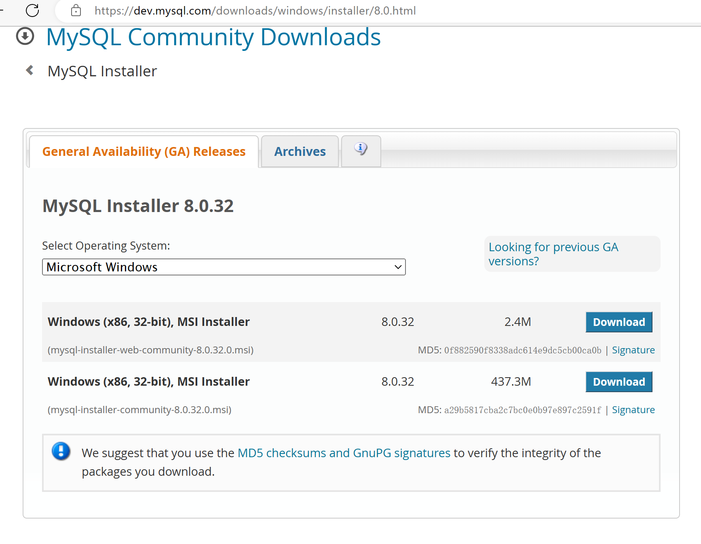
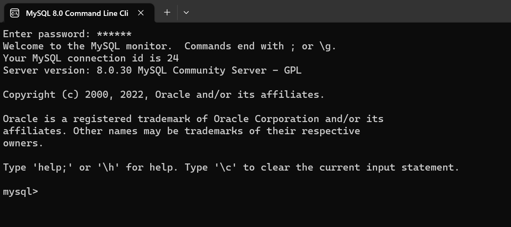

[<< Day 27](../27_Day_Python_with_mongodb/27_python_with_mongodb.md) | [Day 29 >>](../29_Day_Building_API/29_building_API.md)

- [📘 Day 28](#-day-28)
- [Application Programming Interface(API)](#application-programming-interfaceapi)
  - [API](#api)
  - [Building API](#building-api)
  - [💻 Exercises: Day 28](#-exercises-day-28)

# 📘 Day 28

在上一篇中我们学习了nosql数据mongodb，这篇我们将了解学习关系型数据库。sql数据很多，比如Oracle、DB2、SQL Server、Access、MySQL，其中Mysql是在各类开发中应用比较广泛的一种。

本篇作为整个系列的调整补充，学习一下Python操作Mysql数据的基础入门知识。

## Mysql
MySQL是一种开源的关系型数据库管理系统，它是一种客户端/服务器模式的数据库管理系统，由瑞典MySQL AB公司开发，后被Sun公司收购，Sun公司又被Oracle公司收购。MySQL是目前最流行的开源数据库之一，由于其可扩展性，高性能和可靠性而受到广泛关注。MySQL是一种用于存储和管理数据的数据库系统，可以用于开发Web应用程序，大数据，云计算和其他需要持久存储的应用程序。

本文将介绍如何在Python中使用MySQL数据库。我们将学习如何安装和配置MySQL数据库，如何在Python中连接到MySQL数据库，如何执行SQL查询和如何更新和删除数据。按惯例都会提供Python代码示例，以便可以进行实战操作。

### 安装和配置

以下介绍Window环境下的Mysql初始化，其他环境的根据需要Bing搜索教程。

1. 首先，前往MySQL官网的下载页面 (https://dev.mysql.com/downloads/mysql/) 选择与你的系统相应的版本。我这里选择最新的8.x的版本。如果你的系统是64位的Windows系统，那么选择MySQL Installer for Windows（mysql-installer-web-community-xxx.msi）下载。



2. 选择 Developer Default 安装类型。这会安装MySQL Server、MySQL Workbench、MySQL Shell、MySQL Router以及一些其他依赖程序。
3. 在下一步过程中，会有一个安全选项，这里在本系列中建议选择 Use Legacy Authetication Method，即5.x的老方式主要是比较兼容。 
4. 接下来会提示你创建一个MySQL root用户的密码，这是管理数据库所必须的，建议你创建一个安全的密码，并记住它。
5. 剩下默认一路下一步就行，安装完成后，可以通过在Windows菜单中搜索MySQL 8.0 Command Line Client”来打开MySQL命令行客户端。
6. 在MySQL命令行客户端中，可以直接输入密码登录MySQL服务器



7. 登录到MySQL服务器后，可以使用以下命令来查看已有的默认数据库
```sh
  mysql> show databases;
  +-----------------------+
  | Database              |
  +-----------------------+
  | information_schema    |
  | mydatabase            |
  | mysql                 |
  | performance_schema    |
  | sakila                |
  | sys                   |
  | world                 |
  +-----------------------+
  6 rows in set (0.01 sec)
```
8. 如果需要创建新的数据库，可以使用以下命令。其中 mydatabase 是你想创建的数据库名称。
```sh
# 创建数据库命令
create database mydatabase;
# 成功后返回 Query OK, 1 row affected (0.01 sec)

# 使用切换数据库命令
mysql> use mydatabase;
# 成功后返回 Database changed
```
9. 命令行在数据中创建表命令如下
```sh
# 创建新表
create table students (id int AUTO_INCREMENT PRIMARY KEY, name varchar(100), country varchar(20), city varchar(20), age int);
# Query OK, 0 rows affected (0.01 sec)

# 查询表结构 students 为刚创建的表名
DESCRIBE students;
+---------+--------------+------+-----+---------+----------------+
| Field   | Type         | Null | Key | Default | Extra          |
+---------+--------------+------+-----+---------+----------------+
| id      | int          | NO   | PRI | NULL    | auto_increment |
| name    | varchar(100) | YES  |     | NULL    |                |
| country | varchar(20)  | YES  |     | NULL    |                |
| city    | varchar(20)  | YES  |     | NULL    |                |
| age     | int          | YES  |     | NULL    |                |
+---------+--------------+------+-----+---------+----------------+
5 rows in set (0.00 sec)
```

以上就是在Windows系统上下载和配置MySQL的步骤。数据库环境准备好了，接下来就让我们看看 Python 对 Mysql 是如何操作的吧。

### 连接MySQL
在Python中有几个库可以帮助我们快速操作mysql数据库。例如 mysql-connector、MySQLdb和pymysql。本篇内容将使用 mysql-connector 作为重点使用讲解。

首先，需要使用Python的MySQL Connector模块来连接到MySQL数据库。可以通过以下命令来安装该模块：
```sh
pip install mysql-connector-python
```

安装完成后，可以使用以下代码来连接到MySQL数据库
```py
import mysql.connector

mydb = mysql.connector.connect(
  host="localhost",
  user="root",
  password="yourpassword", # 你安装时候设置的root账号密码
  database="mydatabase" # 之前创建的数据库
)

print(mydb)
# 连接成功会打印出数据连接对象内容 如：<mysql.connector.connection_cext.CMySQLConnection object at 0x000001E5228E30D0>
```

在上面的代码中，我们使用了mysql.connector模块来连接到MySQL数据库。在connect()方法中，我们传递了四个参数：
- host：MySQL服务器的地址。在本地使用MySQL时，通常是“localhost”
- user：连接MySQL时使用的用户名
- password：连接MySQL时使用的密码
- database：要连接的数据库名称

在执行完上述代码后，可以通过打印mydb变量来确认是否已经成功连接到MySQL数据库。

### 创建数据库
在连接演示中我们是直接连接了已创建了数据为前提的。但我们是可以先忽略它，通过代码进行创建所需的数据的。下面是重新创建 thirty_days_of_python 的例子。

```py
import mysql.connector

mydb = mysql.connector.connect(
  host="localhost",
  user="root",
  password="yourpassword"
)

mycursor = mydb.cursor()
# 如果数据库已经可以先使用 drop database thirty_days_of_python; 删除掉，这个具体会在后边讲到。
mycursor.execute("CREATE DATABASE thirty_days_of_python")

```
在上面的代码中，我们不指定数据库连接到MySQL服务器，然后创建了一个名为 _thirty_days_of_python_ 的数据库。主要是用到了cursor(游标)执行SQL语法命令。

在执行完以上代码后，可以在MySQL的命令行中输入以下命令来查看是否已经成功创建了数据库。
```
SHOW DATABASES;
```
如果能看到 _thirty_days_of_python_ 出现在列表中，说明数据库已经成功创建。

### 创建表
在一般情况下，数据都是事先创建好的，并且后期也不会轻易换数据名。所以我们在接下创建创建表的过程中，就可以使用最开始直连方式创建数据库连接对象。然后进行其他游标命令，比如接下来的创建表。
```py
import mysql.connector

mydb = mysql.connector.connect(
  host="localhost",
  user="root",
  password="yourpassword",
  database="thirty_days_of_python"
)

mycursor = mydb.cursor()
mycursor.execute("CREATE TABLE students (id int AUTO_INCREMENT PRIMARY KEY, name varchar(100), country varchar(20), city varchar(20), age int)")
```
通过游标创建了一个名为  _students_ 的表格。该表格包含几列，分别为id自增、name姓名、country国家、city城市和age年龄，并都给了对应的数据类型。varcha表示字符类型。在执行完以上代码后，可以在MySQL的命令行中输入以下命令来查看是否已经成功创建了表格：

```sh
mysql> use thirty_days_of_python;
Database changed
mysql> show tables;
+---------------------------------+
| Tables_in_thirty_days_of_python |
+---------------------------------+
| students                        |
+---------------------------------+
1 row in set (0.00 sec)
```

从表列表中可以看到，students学生表已经被成功地创建。

### 插入数据
有了表之后，我们就可以向其插入一条或者多条数据。这里演示插入一条记录的代码：
```py
mycursor = mydb.cursor()
# mycursor.execute("CREATE TABLE students (id int AUTO_INCREMENT PRIMARY KEY, name varchar(100), country varchar(20), city varchar(20), age int)")
sql = "INSERT INTO students (name, country, city, age) VALUES (%s, %s, %s, %s)" # 执行语句
val = ("MegaQi", "China", "ShangHai", 36) # 占位符值
mycursor.execute(sql, val) # 执行游标

mydb.commit() # 提交入库

print(mycursor.rowcount, "record inserted.")
```

在上边的代码中我们分别创建一个sql字符语句和元组值变量，在传入execute后执行了sql insert语句。这里特别注意的是要多一步 commit()，否则增操作不会生效。

同样，我们通过SQL命令行终端，查看下一条学生数据是否被正确插入。

```sh
mysql> SELECT * FROM students;
+----+--------+---------+----------+------+
| id | name   | country | city     | age  |
+----+--------+---------+----------+------+
|  1 | MegaQi | China   | ShangHai |   36 |
+----+--------+---------+----------+------+
1 row in set (0.00 sec)
```

有时候，我们可能需要将大量的数据插入到数据库中，此时可以使用Python的executemany()方法来执行批量插入操作。例如：
```py
mycursor = mydb.cursor()

sql = "INSERT INTO students (name, country, city, age) VALUES (%s, %s, %s, %s)"
val = [
  ('David', 'UK', 'London', 30),
  ('John', 'Sweden', 'Stockholm', 22)
]
mycursor.executemany(sql, val)
mydb.commit()
```

### 查询数据
我们可以使用SELECT语句来从表格中查询数据。其中：
- fetchall：查询所有数据
- fetchone：查询一条，默认符合条件的第一条
- fetchmany: 指定数量查询，相当于sql limit
```py
mycursor.execute("SELECT * FROM students")
myresult = mycursor.fetchall()
for x in myresult:
  print(x)
# (1, 'MegaQi', 'China', 'ShangHai', 36)
```

### 更新数据
对于更新操作，同理只是将执行SQL字符串语句换成UPDATE。比如我们将第一条数据的年龄改成18岁。
```py
# 更新操作
sql = "UPDATE students SET age = 18 WHERE id = 1"
mycursor.execute(sql)
mydb.commit()

# 查询看是否更新成功
mycursor.execute("SELECT * FROM students")
results = myresult = mycursor.fetchall()
print(results)
# [(1, 'MegaQi', 'China', 'ShangHai', 18)]
```

### 删除数据
在更新数据后，我们可以使用DELETE语句来删除表格中的数据。
```py
# 更新操作
sql = "DELETE FROM students WHERE id = 1"
mycursor.execute(sql)
mydb.commit()

# 查询看是否更新成功
mycursor.execute("SELECT * FROM students")
results = myresult = mycursor.fetchall()
print(results)
```
如果结果中没有之前插入第一条数据，说明数据被正确删除。在实际应用场景，表数据是不太建议直接删除，而是增加一个状态字段通过UPDATE操作标记为软删除。

### 执行多SQL语句
有时候，我们可能需要在一个Python程序中执行多个SQL语句，可以使用Python的多行字符串来实现，例如：
```py
import mysql.connector

mydb = mysql.connector.connect(
  host="localhost",
  user="root",
  password="yourpassword",
  database="thirty_days_of_python"
)

mycursor = mydb.cursor()

sql = """
CREATE TABLE students (id int AUTO_INCREMENT PRIMARY KEY, name varchar(100), country varchar(20), city varchar(20), age int);
INSERT INTO students (name, country, city, age) VALUES ("MegaQi", "China", "ShangHai", 36);
INSERT INTO students (name, country, city, age) VALUES ('David', 'UK', 'London', 30);
"""

mycursor.execute(sql)

mydb.commit()

```

在上面的代码中，我们使用三个连续的引号来创建一个多行字符串，将多个SQL语句放在一个字符串中，然后使用execute()方法来执行这些SQL语句。

### 执行事务
事务是一组SQL语句的执行，它们被视为单个操作单元。如果其中任何一条语句失败，整个事务都将被回滚，以确保数据库的一致性和完整性。

在MySQL中，我们可以使用START TRANSACTION、COMMIT和ROLLBACK语句来执行事务。而在Python中，我们可以使用MySQL连接对象的start_transaction()、commit()和rollback()方法来执行事务。例如：
```py
import mysql.connector

mydb = mysql.connector.connect(
  host="localhost",
  user="root",
  password="yourpassword",
  database="thirty_days_of_python"
)

try:
  mydb.start_transaction()

  sql = "INSERT INTO students (name, country, city, age) VALUES (%s, %s, %s, %s)"
  val = ("李雷", "中国", "北京", 30)
  mycursor.execute(sql, val)

  sql_update = "UPDATE students SET age = 18 WHERE name = '李雷'"
  mycursor.execute(sql_update)

  mydb.commit()

except:
  mydb.rollback()
```


本文介绍了如何使用Python连接MySQL数据库，并使用Python执行MySQL的增、删、改、查操作。可以看到Python操作MySQL还比较简单，基本上就是对SQL语句游标语句执行操作。在实践中，我们可以根据具体的需求，灵活使用MySQL提供的功能来操作数据库。同时，在编写Python程序时，也可以使用Python的各种库和函数，来简化和优化操作数据库的代码。

## 💻 第28天练习

1. 自己搭建完成本地MYSQL服务
2. 练习实例中所有的python sql操作
3. 使用python其他第三方库完成同样的mysql数据库操作

🎉 CONGRATULATIONS ! 🎉

[<< Day 27](../27_Day_Python_with_mongodb/27_python_with_mongodb.md) | [Day 29 >>](../29_Day_Building_API/29_building_API.md)
