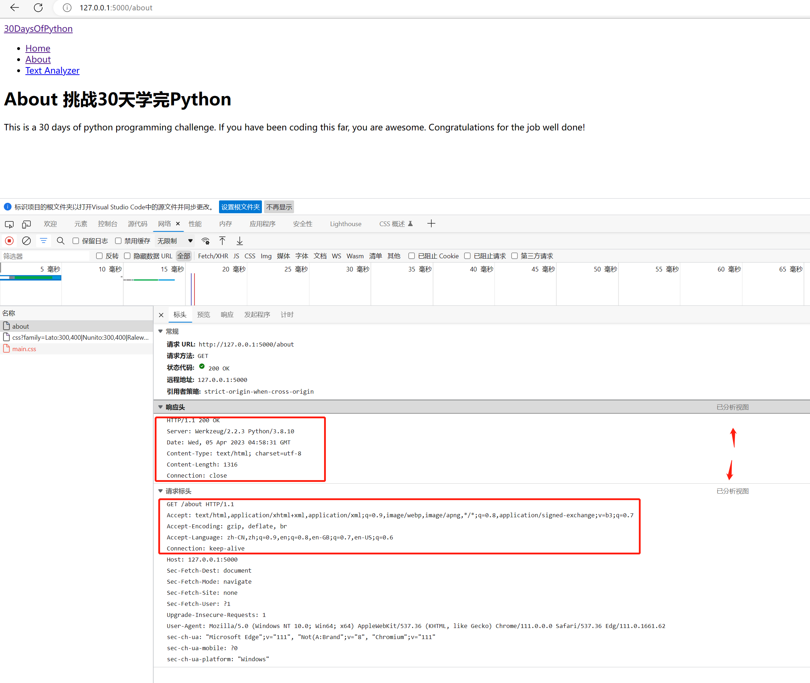
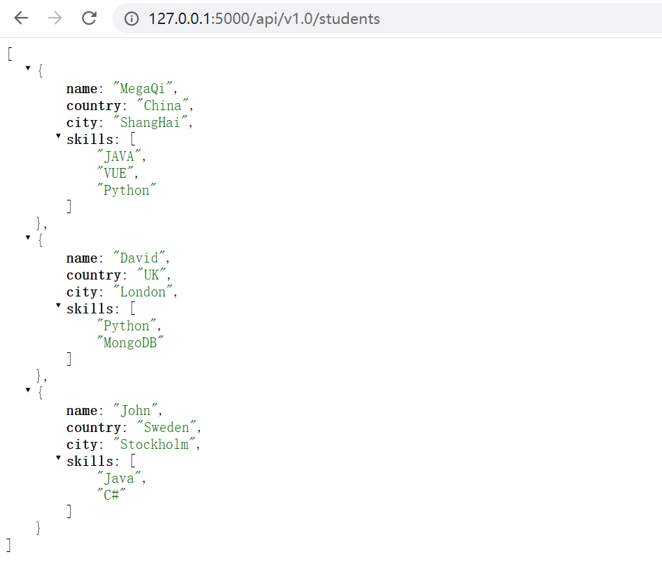
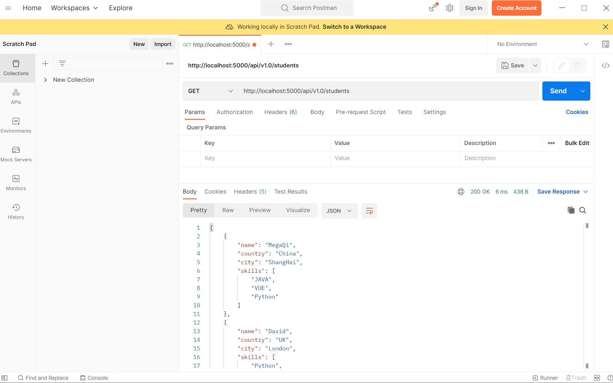
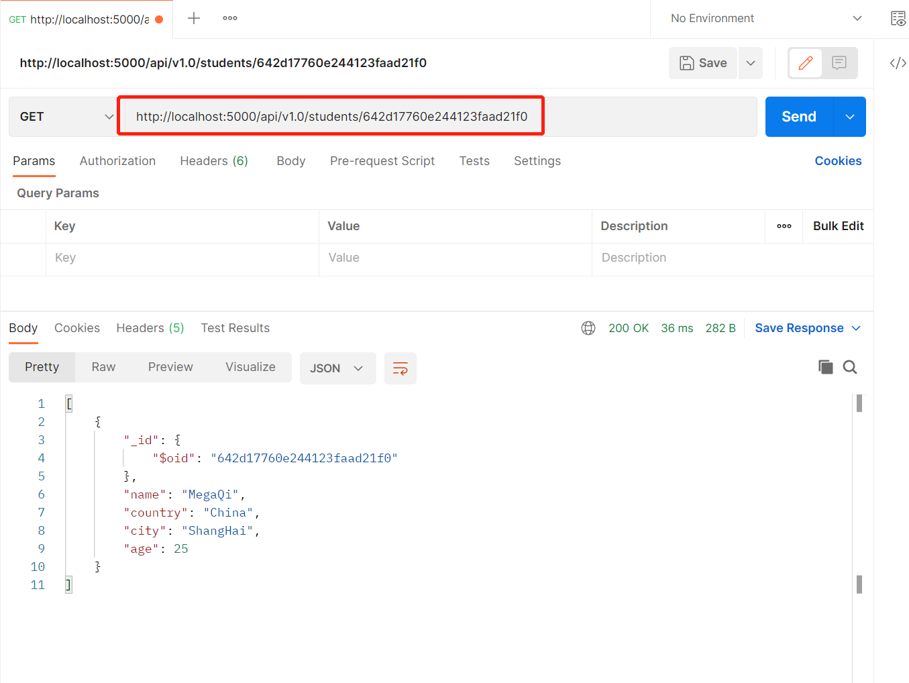
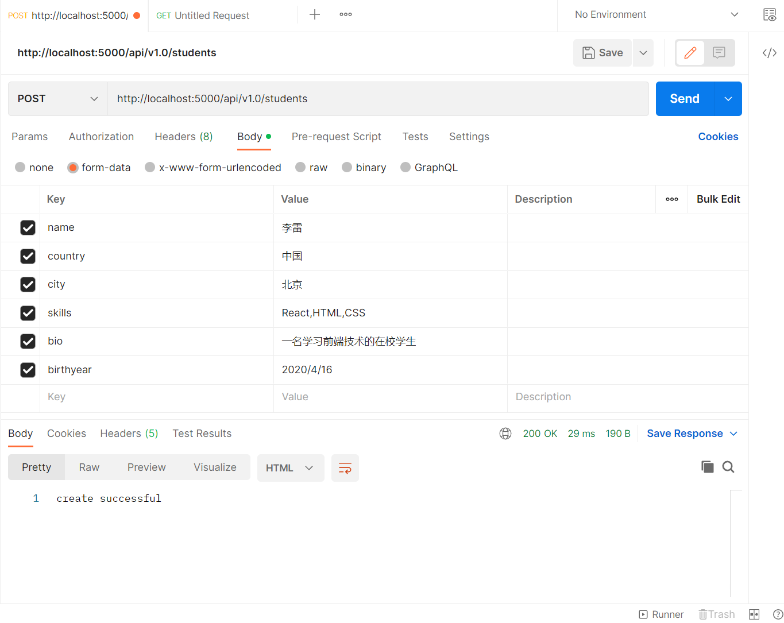
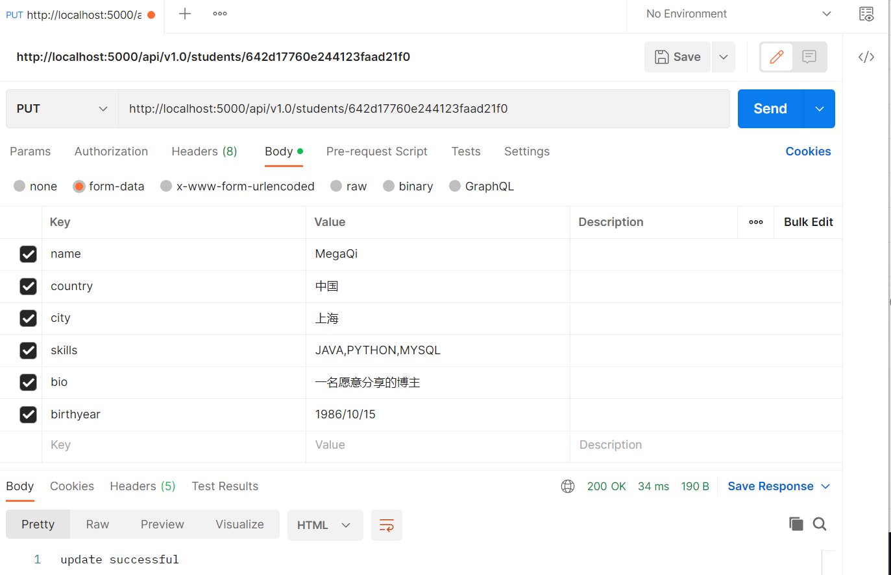
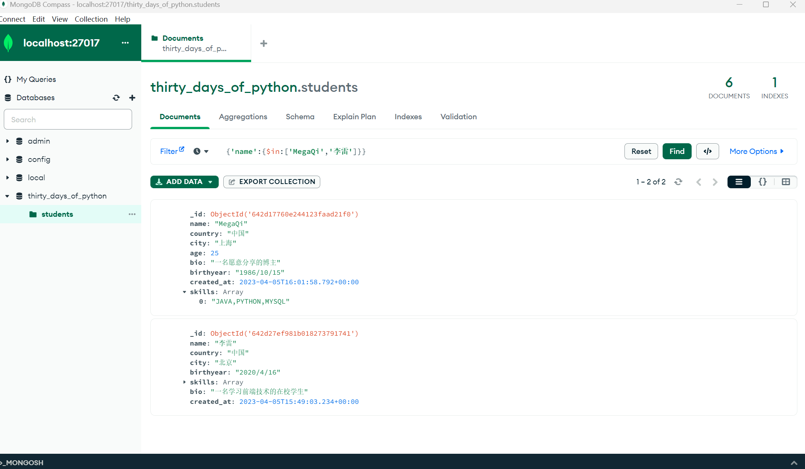
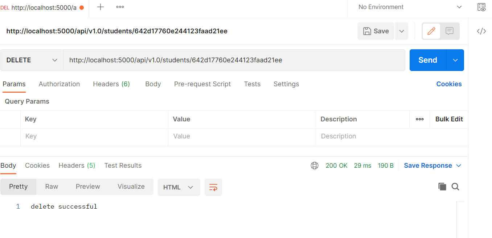

[<< Day 28](../28_Day_Python_with_mysql/28_python_with_mysql.md) | [Day 29 >>](../30_Day_Conclusions/30_conclusions.md)


- [Day 29](#day-29)
- [API基础](#API基础)
  - [HTTP](#HTTP)
    - [请求头行](#请求头行)
    - [响应头行](#响应头行)
    - [头字段](#头字段)
    - [消息体](#消息体)
    - [请求方法](#请求方法)
  - [构建API](#构建API)
    - [使用GET检索数据](#使用GET检索数据)
    - [通过id获取学生详细](#通过id获取学生详细)
    - [使用POST创建数据](#使用POST创建数据)
    - [使用PUT更新数据](#使用PUT更新数据)
    - [使用DELETE删除数据](#使用DELETE删除数据)  
- [💻 第29天练习](#-第29天练习)

# 📘 Day 29

## API基础

英文全称 Application Programming Interface。在这个时代，大多数应用程序都需要使用 API（应用程序编程接口）来与其他应用程序或服务进行通信。 

API是一种允许应用程序之间交互的方式。在互联网上，我们经常使用API从其他应用程序或服务中获取数据或执行某些操作。API允许我们从远程服务器获取数据，而不需要自己存储或管理数据。

例如，您可能会使用天气应用程序获取当地天气预报。该应用程序不会自己生成天气数据，而是使用第三方服务的API获取数据。这个API可能允许应用程序查询天气预报，然后将数据返回给应用程序。

API通常使用REST（Representational State Transfer）协议进行通信，该协议使用HTTP请求和响应来获取和返回数据。我们可以使用Python的requests库来发送HTTP请求，然后使用json模块解析响应。

在本小节中，我们将介绍一个RESTful API，它使用HTTP请求方法来GET、PUT、POST和DELETE数据。

### HTTP

HTTP(Hypertext Transfer Protocol)超文本传输协，是客户端和服务器之间已经确立的通信协议。在这种情况下，客户端是浏览器，而服务器是访问数据的地方。HTTP是一种网络协议，用于传输资源，这些资源可以是世界范围内网站上的文件，无论它们是HTML文件、图像文件、查询结果、脚本或其他文件类型。

浏览器是HTTP客户端，因为它向HTTP服务器（Web服务器）发送请求，服务器然后将响应发送回客户端。

HTTP采用客户端-服务器模型。HTTP客户端打开连接并向HTTP服务器发送请求消息，HTTP服务器返回请求的资源响应消息。当请求-响应周期完成时，服务器关闭连接。


请求和响应消息的格式类似。这两种信息都有
- 一个初始行，
- 零个或多个头部行，
- 一个空行（即一个独立的CRLF），
- 一个可选的消息体（例如一个文件，或查询数据，或查询输出）。

让我们启动Day26时候我们写的一个web程序并请求其中一个接口，打开浏览器开发者工具查看下网络栏里接口信息。


注意：如果浏览器请求的信息和上方不太一样，可以看看是否有箭头处切换“源码(view source)”文本按钮，如果进行切换。否则默认优化过的显示。

#### 请求头行

初始请求行与响应行不同。

请求行有三部分，用空格分隔:

- 方法名 (GET, POST, HEAD)
- 被请求资源的路径
- 使用的HTTP版本 eg: GET / HTTP/1.1

方法中 GET是最常用的帮助获取或读取资源的, POST是创建资源的常用请求方法。

#### 响应头行

初始响应行返回部分，也有由空格分隔的三部分：
- HTTP 版本
- 请求响应状态码，以及描述状态码的原因。状态行示例如下:
```sh
  HTTP/1.0 200 OK
  或
  HTTP/1.0 404 Not Found
```

最常见的状态码有:
- 200 OK：请求成功，结果资源(例如文件或脚本输出)在消息体中返回。
- 500 Server Error：服务器错误

HTTP状态码的完整列表可以在这里(https://httpstatuses.com/)找到。

#### 头字段

正如您在上面的请求返回截图中所看到的，标题行提供了关于请求或响应或者关于消息体中发送的对象的更多信息。

```sh
# 请求信息
GET /about HTTP/1.1
Accept: text/html,application/xhtml+xml,application/xml;q=0.9,image/webp,image/apng,*/*;q=0.8,application/signed-exchange;v=b3;q=0.7
Accept-Encoding: gzip, deflate, br
Accept-Language: zh-CN,zh;q=0.9,en;q=0.8,en-GB;q=0.7,en-US;q=0.6
Connection: keep-alive
Host: 127.0.0.1:5000
Sec-Fetch-Dest: document
Sec-Fetch-Mode: navigate
Sec-Fetch-Site: none
Sec-Fetch-User: ?1
Upgrade-Insecure-Requests: 1
User-Agent: Mozilla/5.0 (Windows NT 10.0; Win64; x64) AppleWebKit/537.36 (KHTML, like Gecko) Chrome/111.0.0.0 Safari/537.36 Edg/111.0.1661.62
sec-ch-ua: "Microsoft Edge";v="111", "Not(A:Brand";v="8", "Chromium";v="111"
sec-ch-ua-mobile: ?0
sec-ch-ua-platform: "Windows"

# 响应信息
HTTP/1.1 200 OK
Server: Werkzeug/2.2.3 Python/3.8.10
Date: Wed, 05 Apr 2023 04:58:31 GMT
Content-Type: text/html; charset=utf-8
Content-Length: 1316
Connection: close
```

#### 消息体
HTTP消息可以在头部行之后包含一段数据主体。在响应中，这是请求的资源返回给客户端的位置（消息主体最常见的用法），或者在出现错误时提供解释性的文本。在请求中，这是用户输入的数据或上传的文件发送到服务器的位置。

如果HTTP消息包含消息主体，则通常会有描述消息主体的头部行。特别是：
- Content-Type：头部行给出了消息主体中数据的MIME类型（text/html，application/json，text/plain，text/css，image/gif）。
- Content-Length：头部行给出了消息主体中字节数的数量。

#### 请求方法

GET、POST、PUT 和 DELETE 是HTTP请求方法，我们可以用它们来实现API或CRUD操作应用程序。

1. GET：GET方法用于通过给定的URI从给定的服务器检索和获取信息。使用GET的请求应该只检索数据，并且不应对数据产生其他影响。
2. POST：POST请求用于创建数据并将数据发送到服务器，例如，使用HTML表单创建新的帖子、文件上传等。
3. PUT：将上传的内容替换目标资源的所有当前表示，并使用它来修改或更新数据。
4. DELETE：删除数据。

## 构建API

在这一部分，我们将介绍一个使用HTTP请求方法来获取(GET)、更新(PUT)、创建(POST)和删除(DELETE)数据的RESTful API。

RESTful API是一个应用程序接口(API)，它使用HTTP请求来获取、更新、创建和删除数据。在之前的章节中，我们学习了Python、Flask和MongoDB。我们将利用所学知识来开发一个使用Python Flask和MongoDB的RESTful API。每个具有CRUD（创建、读取、更新、删除）操作的应用程序都有一个API，用于从数据库中创建数据、获取数据、更新数据或删除数据。

浏览器只能处理GET请求。因此，我们需要一个工具来处理所有请求方法（GET、POST、PUT、DELETE）。

这里先提一款接口流程测试工具叫 [Postman](https://www.getpostman.com/)，后边的内容我们将使用它进行演示。如果你的电脑上没有，请先到 https://www.getpostman.com 官方下载安装。


接下来，让我们综合之前所学的内容，开发一个关于学生信息的管理服务API。此信息存储在mongodb中包含：姓名, 国家, 城市, 生日, 技能 和 简历.

要实现这个API，我们将使用：
- Postman
- Python
- Flask
- MongoDB

### 使用GET检索数据

在这一步中，让我们使用虚拟数据并将其作为JSON返回。为了将其作为JSON返回，我们将使用json模块和Response模块。

```py
from flask import Flask, Response
import os
import json

app = Flask(__name__)

@app.route('/api/v1.0/students', methods = ['GET'])
def students ():
    student_list = [
        {
            'name':'MegaQi',
            'country':'China',
            'city':'ShangHai',
            'skills':['JAVA', 'VUE','Python']
        },
        {
            'name':'David',
            'country':'UK',
            'city':'London',
            'skills':['Python','MongoDB']
        },
        {
            'name':'John',
            'country':'Sweden',
            'city':'Stockholm',
            'skills':['Java','C#']
        }
    ]
    return Response(json.dumps(student_list), mimetype='application/json')

if __name__ == '__main__':
    port = int(os.environ.get("PORT", 5000))
    app.run(debug=True, host='0.0.0.0', port=port)
```

当你通过浏览器请求此接口 http://localhost:5000/api/v1.0/students 后你将得到如下结果：



你也可通过pastman工具进行请求 http://localhost:5000/api/v1.0/students 它将得到同样的返回结果：



让我们进一步优化程序，将Mock的数据改为MongoDB获取。
```py
from flask import Flask, Response
from bson import json_util
import pymongo
import os
import json

app = Flask(__name__)

MONGODB_URI = "mongodb://localhost:27017/"
client = pymongo.MongoClient(MONGODB_URI)
db = client['thirty_days_of_python']

@app.route('/api/v1.0/students', methods = ['GET'])
def students ():
    student_list = db.students.find() # 查询所有学生
    # 请注意此处使用一个json_util转换而非json，否则mongo查询所有字段所带_id会报错
    # return Response(json.dumps(student_list), mimetype='application/json')
    return Response(json_util.dumps(student_list), mimetype='application/json') 

if __name__ == '__main__':
    port = int(os.environ.get("PORT", 5000))
    app.run(debug=True, host='0.0.0.0', port=port)
```
如果之前的练习中你已经将学生数据删除了，请提前重新添加一些。再次通过postman请求数据你将得到从数据库查询的学生列表。

```sh
[
    {
        "_id": {
            "$oid": "642d17760e244123faad21ee"
        },
        "name": "David",
        "country": "UK",
        "city": "London",
        "age": 34
    },
    {
        "_id": {
            "$oid": "642d17760e244123faad21ef"
        },
        "name": "John",
        "country": "Sweden",
        "city": "Stockholm",
        "age": 28
    },
    {
        "_id": {
            "$oid": "642d17760e244123faad21f0"
        },
        "name": "MegaQi",
        "country": "China",
        "city": "ShangHai",
        "age": 25
    },
    {
        "_id": {
            "$oid": "642d17760e244123faad21f1"
        },
        "name": "Sami",
        "country": "Finland",
        "city": "Helsinki",
        "age": 25
    },
    {
        "_id": {
            "$oid": "642d17760e244123faad21f2"
        },
        "name": "Tom",
        "country": "Kroen",
        "city": "Seoul",
        "age": 26
    }
]
```

### 通过id获取学生详细

我们可以使用id访问单个文档，即写一个根据条件获取一名学生的详细信息。
http://localhost:5000/api/v1.0/students/<_id>

```py
from flask import Flask, Response
from bson import json_util, ObjectId
import pymongo
import os
import json

app = Flask(__name__)

MONGODB_URI = "mongodb://localhost:27017/"
client = pymongo.MongoClient(MONGODB_URI)
db = client['thirty_days_of_python']

@app.route('/api/v1.0/students', methods = ['GET'])
def students ():
    student_list = db.students.find() # 查询所有学生
    # 请注意此处使用一个json_util转换而非json，否则mongo查询所有字段所带_id会报错
    # return Response(json.dumps(student_list), mimetype='application/json')
    return Response(json_util.dumps(student_list), mimetype='application/json') 

@app.route('/api/v1.0/students/<id>', methods = ['GET'])
def single_student (id):
    student = db.students.find({'_id':ObjectId(id)})
    return Response(json_util.dumps(student), mimetype='application/json')

if __name__ == '__main__':
    port = int(os.environ.get("PORT", 5000))
    app.run(debug=True, host='0.0.0.0', port=port)
```
请求新增根据ID的查询结果如下（注意ID信息根据你自己的数据进行替换）：



### 使用POST创建数据

我们使用POST请求方法创建学生数据

```py
@app.route('/api/v1.0/students', methods = ['POST'])
def create_student ():
    name = request.form['name']
    country = request.form['country']
    city = request.form['city']
    skills = request.form['skills'].split(', ')
    bio = request.form['bio']
    birthyear = request.form['birthyear']
    created_at = datetime.now()
    student = {
        'name': name,
        'country': country,
        'city': city,
        'birthyear': birthyear,
        'skills': skills,
        'bio': bio,
        'created_at': created_at

    }
    db.students.insert_one(student)
    return "create successful"
```
请求测试，为了更准确验证，一般还要在数据库确认是否正确落库。



### 使用PUT更新数据

```py
@app.route('/api/v1.0/students/<id>', methods = ['PUT'])
def update_student (id):
    query = {"_id":ObjectId(id)}
    name = request.form['name']
    country = request.form['country']
    city = request.form['city']
    skills = request.form['skills'].split(', ')
    bio = request.form['bio']
    birthyear = request.form['birthyear']
    created_at = datetime.now()
    student ={
        '$set': {
            'name': name,
            'country': country,
            'city': city,
            'birthyear': birthyear,
            'skills': skills,
            'bio': bio,
            'created_at': created_at
        }
    }
    db.students.update_one(query, student)
    return "update successful"
```
在代码编写上述更新接口，并重启程序进行请求测试



最后在数据中查看下刚才增改两个操作是否正确



### 使用DELETE删除数据

```py
@app.route('/api/v1.0/students/<id>', methods = ['DELETE'])
def delete_student (id):
    db.students.delete_one({"_id":ObjectId(id)})
    return "delete successful"
```

在本次数据演示中我们删除一条名叫 David 学生数据。



以上第二小部分内容中，我们实现了一个标准 RESTful 风格的API程序。在平常工作中可能大家见到的接口基本都是GET/POST两种，研发通过接口名区分其他操作，而不是用这种请求方法。

## 💻 第29天练习
1. 阅读和了解 HTTP / RESTful API 基础知识的内容
2. 参照学生学生管理操作，请写一些员工管理接口。

🎉 CONGRATULATIONS ! 🎉

[<< Day 28](../28_Day_Python_with_mysql/28_python_with_mysql.md) | [Day 30 >>](../30_Day_Conclusions/30_conclusions.md)
