[English](https://github.com/Asabeneh/30-Days-Of-Python) | 简体中文

# 🐍 挑战30天学完Python

| # 天 |                                          文章目录                                          |
|-----|:--------------------------------------------------------------------------------------:|
| 01  |                                [初识Python](./readme.md)                                 |
| 02  |   [变量和内置函数](./02_Day_Variables_builtin_functions/02_variables_builtin_functions.md)    |
| 03  |                     [布尔值和运算符](./03_Day_Operators/03_operators.md)                      |
| 04  |                     [数据类型-字符串str](./04_Day_Strings/04_strings.md)                      |
| 05  |                       [数据类型-列表list](./05_Day_Lists/05_lists.md)                        |
| 06  |                      [数据类型-元组tuple](./06_Day_Tuples/06_tuples.md)                      |
| 07  |                         [数据类型-集合set](./07_Day_Sets/07_sets.md)                         |
| 08  |                [数据类型-字典dict](./08_Day_Dictionaries/08_dictionaries.md)                 |
| 09  |                [Conditionals](./09_Day_Conditionals/09_conditionals.md)                |
| 10  |                          [Loops](./10_Day_Loops/10_loops.md)                           |
| 11  |                    [Functions](./11_Day_Functions/11_functions.md)                     |
| 12  |                       [Modules](./12_Day_Modules/12_modules.md)                        |
| 13  |       [List Comprehension](./13_Day_List_comprehension/13_list_comprehension.md)       |
| 14  | [Higher Order Functions](./14_Day_Higher_order_functions/14_higher_order_functions.md) |     
| 15  |       [Python Type Errors](./15_Day_Python_type_errors/15_python_type_errors.md)       | 
| 16  |          [Python Date time](./16_Day_Python_date_time/16_python_datetime.md)           |     
| 17  |       [Exception Handling](./17_Day_Exception_handling/17_exception_handling.md)       |    
| 18  |     [Regular Expressions](./18_Day_Regular_expressions/18_regular_expressions.md)      |    
| 19  |              [File Handling](./19_Day_File_handling/19_file_handling.md)               |
| 20  | [Python Package Manager](./20_Day_Python_package_manager/20_python_package_manager.md) |
| 21  |     [Classes and Objects](./21_Day_Classes_and_objects/21_classes_and_objects.md)      |
| 22  |                [Web Scraping](./22_Day_Web_scraping/22_web_scraping.md)                |
| 23  |     [Virtual Environment](./23_Day_Virtual_environment/23_virtual_environment.md)      |
| 24  |                   [Statistics](./24_Day_Statistics/24_statistics.md)                   |
| 25  |                         [Pandas](./25_Day_Pandas/25_pandas.md)                         |
| 26  |                   [Python web](./26_Day_Python_web/26_python_web.md)                   |
| 27  |     [Python with MongoDB](./27_Day_Python_with_mongodb/27_python_with_mongodb.md)      |
| 28  |                             [API](./28_Day_API/28_API.md)                              |
| 29  |                [Building API](./29_Day_Building_API/29_building_API.md)                |
| 30  |                 [Conclusions](./30_Day_Conclusions/30_conclusions.md)                  |

🧡🧡🧡 祝君编码学习愉快 🧡🧡🧡


[Day2 变量和内置函数 >>](./02_Day_Variables_builtin_functions/02_variables_builtin_functions.md)


# 📘 Day 1：初识Python

## 开篇说

> 🎉 本系列为Python基础学习，原稿来源于github英文项目，大奇主要是对其本地化翻译、逐条验证和补充，想通过30天完成正儿八经的系统化实践。此系列适合零基础同学，会简单用但又没有系统学习的使用者。总之如果你想提升自己的Python技能，欢迎加入《挑战30天学完Python》。

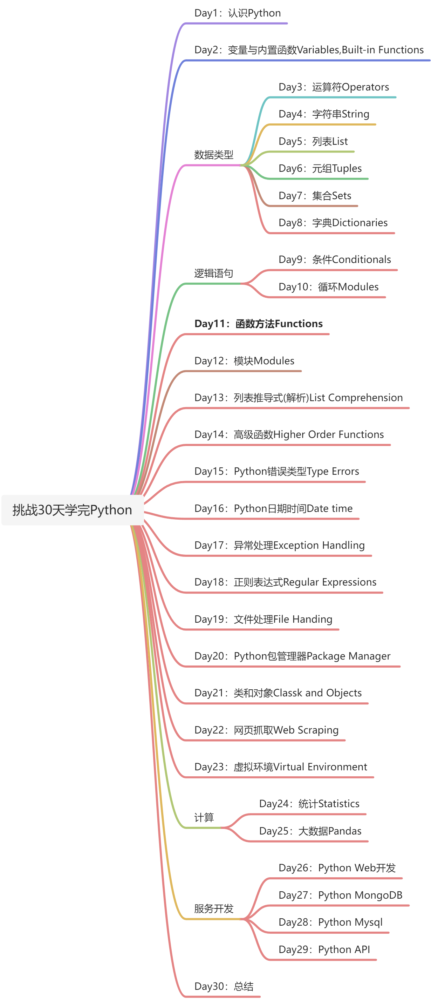
首先给出未来30天学习的思维导图，让我们了解它后开始正式的学习。

## 为什选它？
Python是一种非常接近自然语言的高级编程语言，因此易于学习和使用。Python被各行各业和包括Google在内的公司使用，它被应用于开发Web、桌面应用系统管理和机器学习。Python在数据科学领域和机械学习社区是很受欢迎的语言。希望这些理由可以说服你开始学习Python这门语言。
> 💡 补充：在测试行业里很多自动化、工具也都在使用Python，如果没有任何开发语言基础，简单易学可以快速入门的它是非常不错的选择。
## 环境配置
### 安装Python
运行python脚本需要安装依赖环境，让我们从官方 [https://www.python.org/downloads/](https://www.python.org/downloads/) 进行下载。
需要注意的是默认下载页面的版本，一般是最新的Release版本，如图中的红圈出是`3.10.6`，如果是纯学习3.6+都可以，这里笔者为了兼容更好选择了`3.8.10`版本，后续的代码演示也会基于此版本。


下载历史版本需要在` looking for specific release?`里查找，比如`Ctrl+F`搜索到了Python 3.8.10，点击对应行的Download即会跳转到下载页面。
> 💡 Tips：图中还可以看到3.8.11、12版本，这个两个是后来的小版本升级，进入download只有源码包，没有直接安装包，所以为了方便安装我们最终选定10版本。
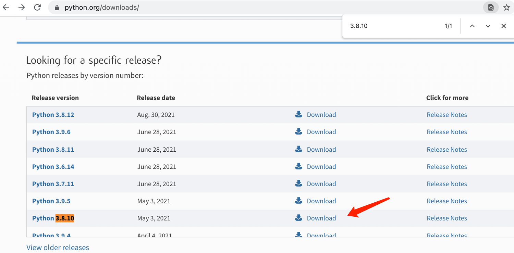

如果你使用的是windows用户，可以点击图中红色框内对应系统位数版本下载，如果是Mac用户选择绿色框内对应os系统版本下载，其他linux系统则需要通过source版本配置。
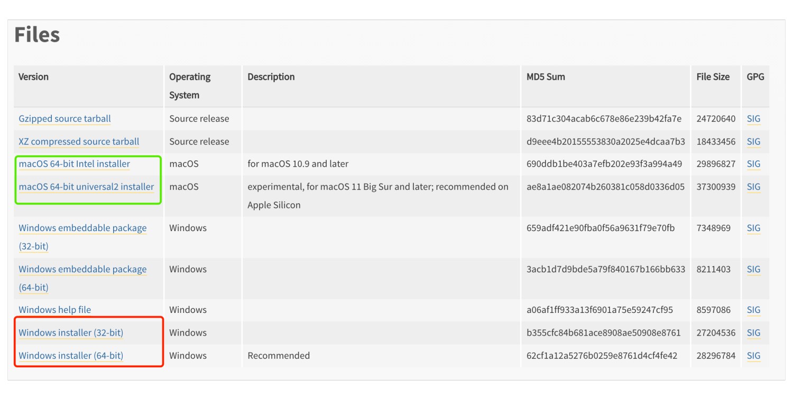

安装包方法进行安装比较简单就省略了，如果有问题或者需要配置环境变量，网上安装教程也很多，自行搜索解决下，这里当python安装好后让我们启动一个终端，通过命令行检查下安装情况。
```shell
pyhton --version

# 如mac或系统有共存的2.7版本，需要通过python3查看
pyhton3 --version
```
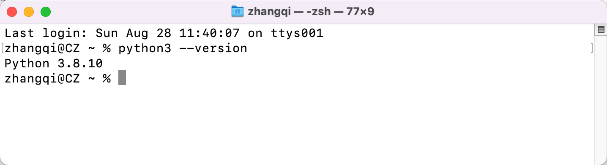
当你看到版本信息的时候就证明python已经在电脑上安装好，如果你是其他版本也无妨，不影响接下来的学习。

### Python Shell
Python是解释型脚本语言，因此它不需要编译，这意味着它将逐行执行代码。Python带有一个Python Shell（交互式命令行）。它被用于执行单行phthon命令并得到相应结果。
```shell
python3  #python 
```

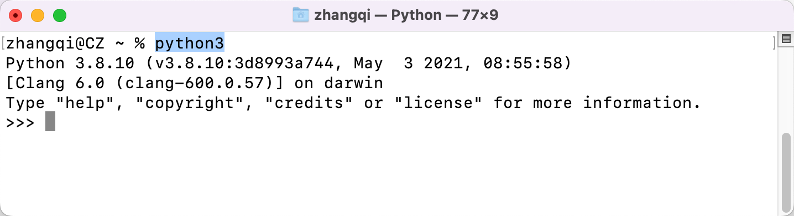

此时python交互式shell已经打开，并且等待你写入代码（python 脚本），在符号 `>>>`写下你的代码然后按下Enter回车键，那么接下来让我们在python shell 写下第一个脚本。

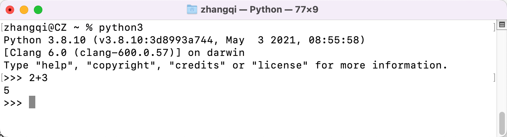

很好，在交互Shell控制台上你已经写下了第一个脚本，简单做了个加法计算`2+3`，并得到结果`5`输出。那么如何关闭python shell呢？要退出只需要在符号`>>>`输入 `exit()`命令并且按下回车键即可。

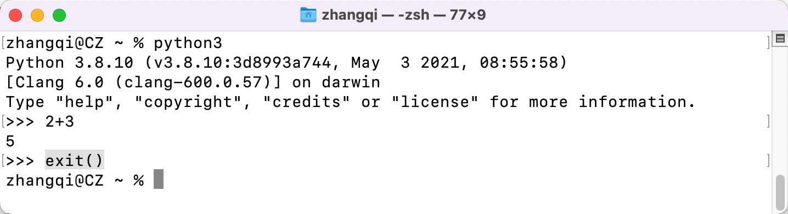

到现在为止，你已经知道如何打开Python shell 以及如何退出它了。

如果你写下的代码能被python正确解读，它将返回一个结果，否则将看到一个错误。让我们故意制造一个错误来看看它是如何返回的。

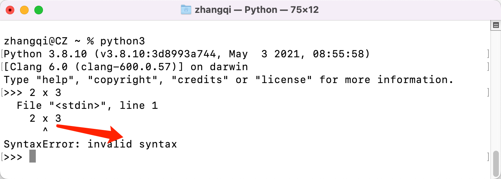

正如你看到返回的错误，Python很聪明，它发现了一个 **Syntax Error: invalid syntax** 错误。使用了错误的乘法语法，因为在python中（`x`）不是一个有效关键词，要实现乘法计算，我们需要使用（`*`）来替换（x）。返回的错误很明显地展示了如何修复它。

从程序中找到错误并移除它的过程叫 `调试`，接下来让我们用 `*` 替换掉 `x` 通过调试来修复错误。

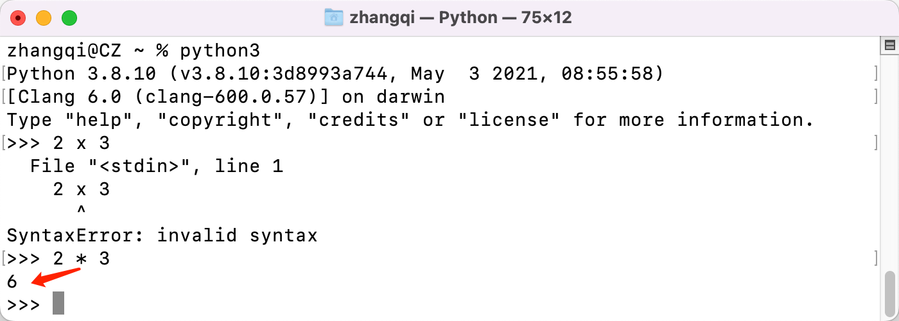

我们的bug此时已经被正确修复，代码正常运行并得到预期的结果（2乘3等于6）。作为一名程序员在每天的编程中你都会遇到这样那样的错误。知道如何调试问题是一件好事。

为了更好调试你应该了解常见的错误的类型。你将来可能会遇到的一些Python错误类型包括但不限于 _SyntaxError、IndexError、NameError、ModuleNotFoundError、KeyError、ImportError、AttributeError、TypeError、ValueError、ZeroDivisionError _等。在后续的实战中将会看到更多不同的 **错误类型信息**。

让我们继续在Python shell 做一些练习，回到终端并次进入交互模式，不要忘记进入命令是`python`或`python3`。


在Python shell模式下，我们先进行一些基础的数学运算操作（加法、减法、乘法、除法、取模、指数）。
编写正式pyton代码之前先做一些数学计算：
- 3 + 7 = 10 
- 7 - 2 = 5
- 2 * 6 = 12
- 3 / 2 = 1.5
- 3 ** 2 = 3 x 3 = 9

再在做一些而外的操作：
- 5 % 2 = 1 取模即求余数
- 5 // 2 = 2 地板除即求商

接下来让我们把上边的数学练习转成pthon代码。不过在这之前我们先在打开的python shell开头写下注释。
_**注释 **_在python代码中是不被执行的，所以我们可以在合适的地方增加一些文字说明来增加代码可读性。python 中单行注释以 `hash(#)`符号开头。以下演示和如何在python写注释

```python
# 注释以hash开头
# 这是一个python的注解，因为它开头用了符号（#） 
```

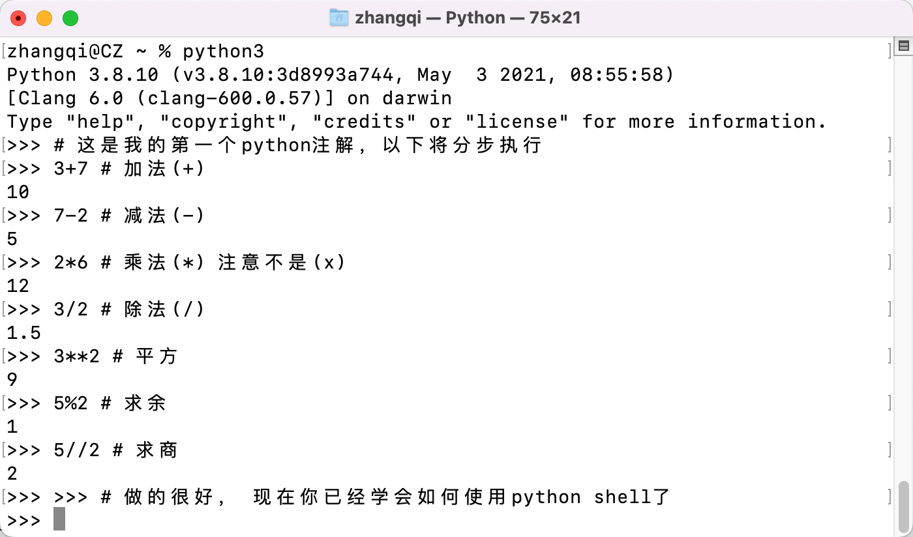

在继续下一节之前，让我们在Python shell 做更多的练习。通过`exit()`命令退出shell模式，然后再重新打开并尝试编写一些字符交互。

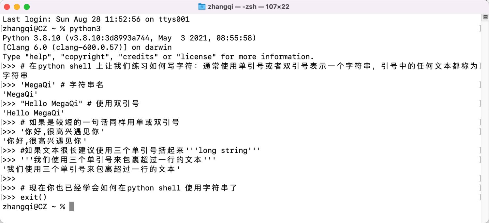

### 下载 Visual Studio

Python shell 非常适合尝试和测试小型脚本代码，但不适合大型项目开发。在实际工作环境中，开发人员使用不同的代码编辑器进行代码编写。在这30天的python编程学习挑战中，我们将使用非常流行的开源的Visual Studio代码编辑器，推荐使用官方[https://code.visualstudio.com/](https://code.visualstudio.com/)最新版本。当然如果电脑上已经有其他的编辑器，根据你的个人情况进行选择。
> 💡 Tips：VS Code是一个非常不错的开源编辑器，虽然商国内商业版的Pycharm用的更多，但如果没你没有商业Key非常不建议花大量的时间取折腾一个IDE，编程学习重要的是学习语言语法和应用。

[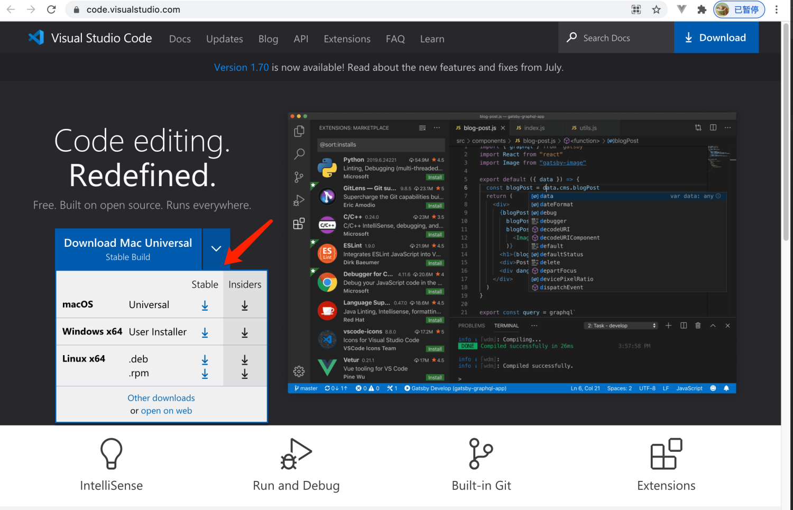](https://code.visualstudio.com/)
假设你已经下载并安装好了VS Code IDE，让我们来看下是如何使用它。

### 如何使用 VS Code

通过桌面或者应用程序里点击Visual Stuido图标启动，当你打开它时你将看到这样的默认欢迎界面，你可以去掉勾选 **show welcome page on startup** 关闭，这样在每次启动后将不再出现。
> 💡 Tips：由于网络原因可能网站打不开或或者下载失败，可以搜下已下载安装包或者找联系我发送你对应的包。

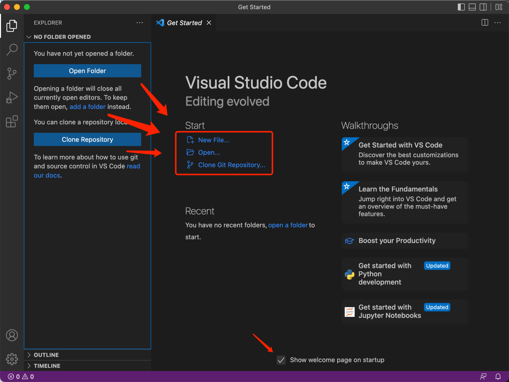

此时你可以打开现有项目，从git仓库中clone项目，也可以新建一个文件夹或文件。

在电脑中合适的位置我们创建一个文名称为 30DaysOfPython 文件夹，然后使用Visual Studio打开它。如果提示信任警告，请选择Yes。

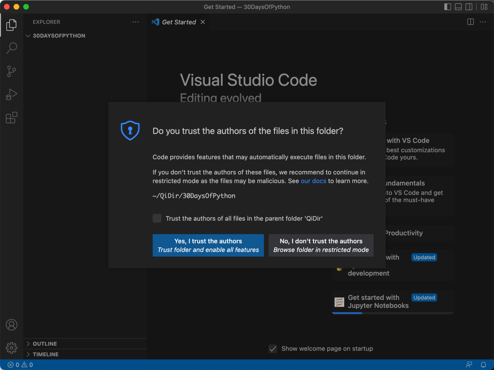

打开项目文件夹后，在展开项目并且鼠标放在上边的时候会快捷按钮，正如图片中所示，我已经通过创建文件按钮，创建了一个helloworld.py尝试完成你的创建。

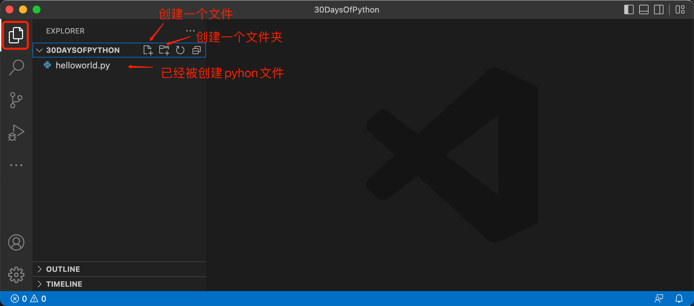

事实上VS Code是支持多语言的，在对应区域下载默认会带有本地语言包，如果没有你可以通过切换到插件商店，搜索chinese安装进行安装。

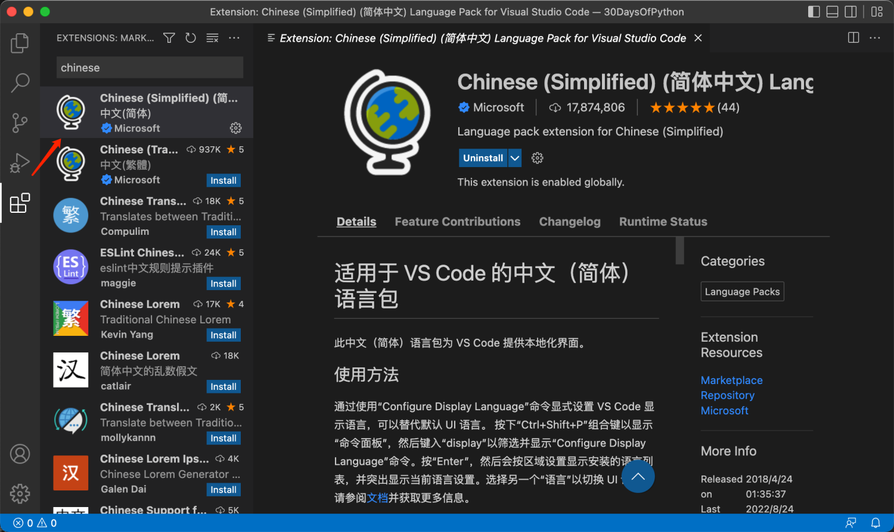

如果没安装或没完全中文化，可以通过快捷键`Command + Shift + P`(Window为Ctrl + Shift +P）打开命令配置，输入"configure language" 选中语言显示配置->` zh-cn `重新配置。

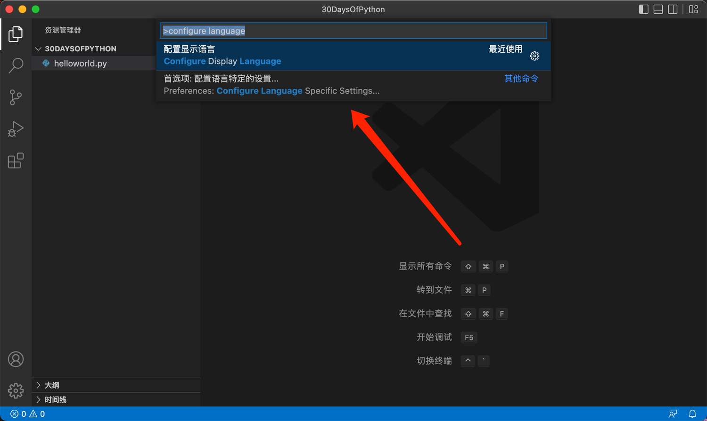

重启后你就能看到全中文界面。

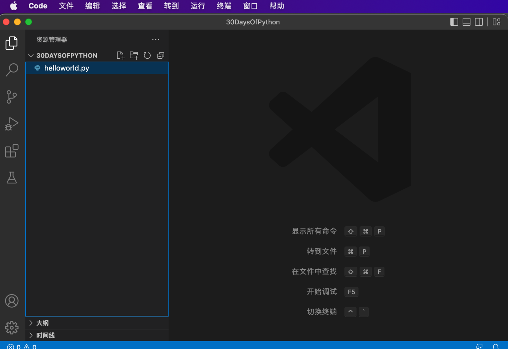

恭喜你，你已经完成开发环境的配置，让我们开始进行编码吧。

## Python基础
代码可以在Python shell 或者IDE中编写。它的文件扩展名为`**.py**`

### 缩进
在文本中一个缩进是空白，许多语言中缩进用于增加代码的可读性，不过Python中用来创建代码块。其他语言中（如Java）通常用括号创建代码块。编写python代码时常见的错误之一就是错误的缩进。

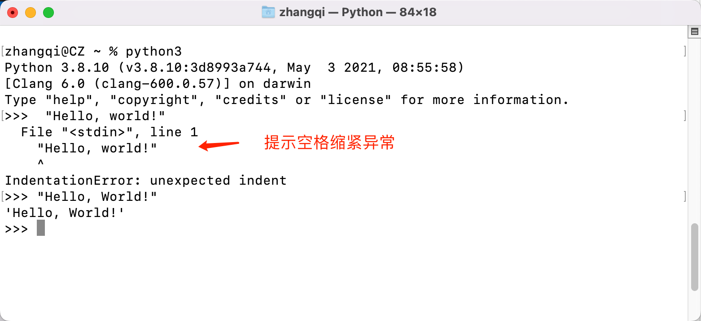

### 注释
在我们编写的代码中`注释`是非常重要，它使得代码变得更易读。Python中任何行以（#）开头的是一行注释，它在代码运行时候是不会被执行的。

**示例：单行注释**
``` python
# 这是第一行注释
# 这是第二行注释
# Python是很受欢迎的语言
```

**示例：多行注释**
使用三个引号将文本引用以来，它将是一个多行的注释
``` python
"""这是多行注释
它可以进行换行.
Python变得越来越流行
"""
```

### 数据类型

在Python中有几种数据类型，让我们从最常见一些开始学习。不同的数据类型在其他章节中得到详细讲解。目前来讲，先让我们来来了解下都有哪些数据类型，再次说明下，你现在无需立马弄懂每个类型。

#### 数字

- 整数int：整数（负、零和正）示例：... -3、-2、-1、0、1、2、3 ...
- 浮点数float：十进制数 示例 ... -3.5, -2.25, -1.0, 0.0, 1.1, 2.2, 3.5 ...
- 复杂complex 示例 1 + j, 2 + 4j

#### 字符串str

单引号或双引号里的一个或者多个字的集合。如果字符串多于一个句子或多行，则使用三个引号。
```python
'Hi'
'MegaQi'
'Python'
'我喜欢教学与分享'
'I hope you are enjoying the first day of 30DaysOfPython Challenge'
```

#### 布尔bool

布尔类型只有两个值 `True` 或 `Flase`，注意 T 和 F 始终是大写。
```python
True  # 逻辑举例：灯亮着吗? 如果它是开的，则值为 True
False # 灯亮着吗?如果关闭，则值为 False
```

#### 列表List

Python list 是一个有序集合，它允许存储不同的数据类型项。类似于 JavaScript 中的数组。

```python
# 所有类型均为数字
[0, 1, 2, 3, 4, 5]

# 所有项都是字符串类型（水果）
['香蕉', '橙子', 'Mango'] 

# 混合类型，包括了字符、整数、布尔和浮点
['芒果', 10, False, 9.81]
```

#### 字典dict

Python 字典对象是键值对格式的无序数据集合。
```python
{
'name':'大奇',
'country':'中国', 
'age':35, 
'is_married':True,
'skills':['Python', 'React', 'Node', 'Java', 'Vue']
}
```

#### 元组tuple

元组也是一个有序集合，但它不同于List。元组一旦创建就不能修改，它们是不可变的。
```python
# 七大行星
('地球', '木星', '海王星', '火星', '金星', '土星', '天王星', '水星') 
```

#### 集合set
集合是类似于列表和元组的数据类型的集合。与列表和元组不同，集合项不是有序的。与数学一样，`set`在python 仅保存不重复的值。
```python
{2, 4, 3, 5}
{3.14, 9.81, 2.7} # 在set中顺序并不重要
```

### 查看数据类型

要检查某些数据/变量的类型，我们使用`**type**`函数。在以下Python shell中，你将看到不同的 python 数据类型：

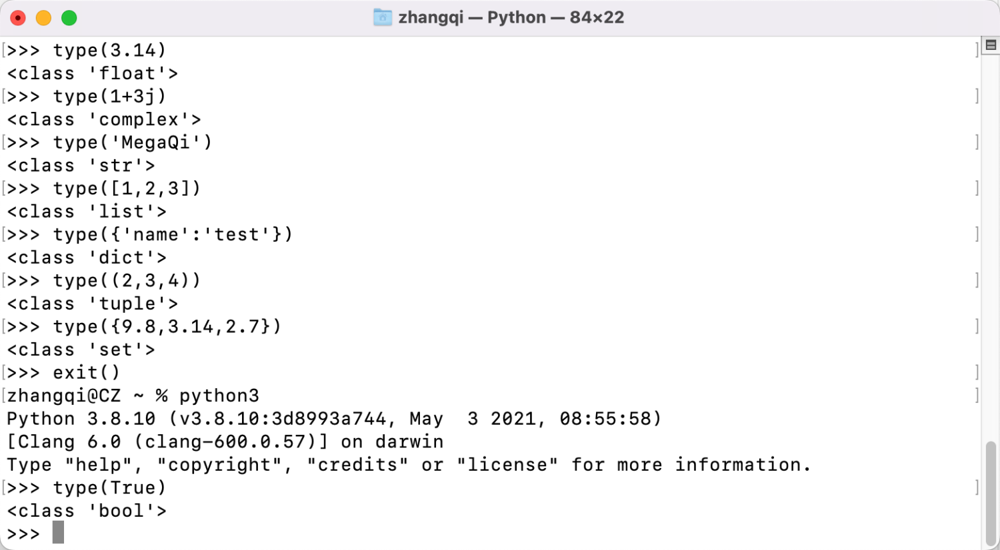

### Python文件

假设已经创建好了python学习文件夹，如名为 `30DayOfPython`，但如果没有请通过编辑器创建它。并且在此文件夹中，创建一个名为`helloworld.py`的文件。现在让我们在Visual Studio上看下是如何进行代码交互的。
Python Shell中打输出结果时没用使用print打印，但在VS Code中要看到结果需要使用`*print()`函数，print()括号内接受一个或多个参数，参考形式如 print('参数1','参数2')。具体可以看下边的例子。
**例子**（文件为helloworld.py）

```python
# Day 1 - 30天Python学习挑战
# 数据计算
print(3 + 7)             # 加 addition(+)
print(7 - 2)             # 减 subtraction(-)
print(2 * 6)             # 乘 multiplication(*)
print(3 / 2)             # 除 division(/)
print(3 ** 2)            # 次方 exponential(**)
print(5 % 2)             # 求余 modulus(%)
print(5 // 2)            # 求商 Floor division operator(//)

# 打印数据类型
print(type(10))          # 整数 Int
print(type(3.14))        # 浮点 Float
print(type(1 + 3j))      # 复数 Complex number
print(type('MegaQi'))    # 字符串 String
print(type([1, 2, 3]))   # 列表 List
print(type({'名称':'大奇'})) # 字典 Dictionary
print(type({9.8, 3.14, 2.7}))    # 集合 Set
print(type((9.8, 3.14, 2.7)))    # 元组 Tuple
```

要运行python文件，请参考下图。

- 方式1：通过点击VS Code上的三角▶️按钮运行
- 方式2：在编辑底部打开的终端上输入 `python3 helloworld.py `来运行
> 💡 提示：如果没显示终端，依次通过编辑器菜单->终端->新建终端 打开。

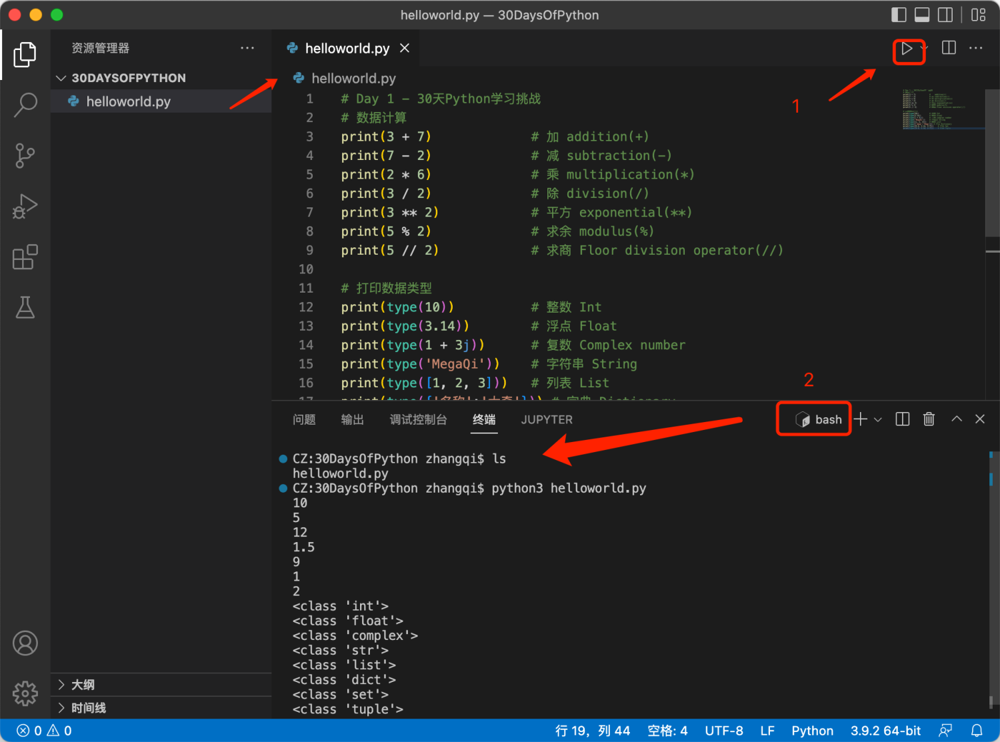

🌕 你太棒了，你已经完成了第1天的挑战，并且正在成功的路上前进。现在趁热做一些练习吧，来加强大脑和肌肉记忆。

## 💻 第1天练习

### 练习1级

1. 请用命令查看你正在使用的python版本。
2. 打开python shell并进行如下操作。操作数是 5 和 3。
   - 加法（+）
   - 减法（-）
   - 乘法（*）
   - 求余（%）
   - 除法（/）
   - 次方（**）
   - 求商（//)
3. 在 python shell 上编写如下字符串并输出：
   - 你的姓名
   - 你的国家
   - 你喜欢的一句话
   - I am enjoying 30 days of python
4. 检查以下数据类型：
   - 10
   - 9.8
   - 3.14
   - 5 - 5j
   - ['Python'，'Java']
   - (1,2,3)
   - 你的国家

### 练习2级

1. 在 30DaysOfPython 项目文件夹下创建一个名为 **day_1**的新文件夹。并在此文件下里创建一个新的文件 helloworld.py，然后重做练习1中2-4项。记得python文件打印结果要使用函数**print() 。**编写好你的代码后保存并用两种不同的方式运行它。

### 练习3级

1. 为不同python数据类型写一个示例，例如 Number(Integer, Float, Complex)、String、Boolean、List、Tuple、Set 和 Dictionary
2. 计算出两点之间的距离（2,3) 和 (10,8)
3. 
🎉 CONGRATULATIONS ! 🎉

[Day 2 >>](./02_Day_Variables_builtin_functions/02_variables_builtin_functions.md)